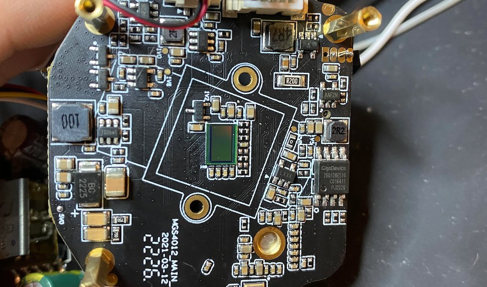
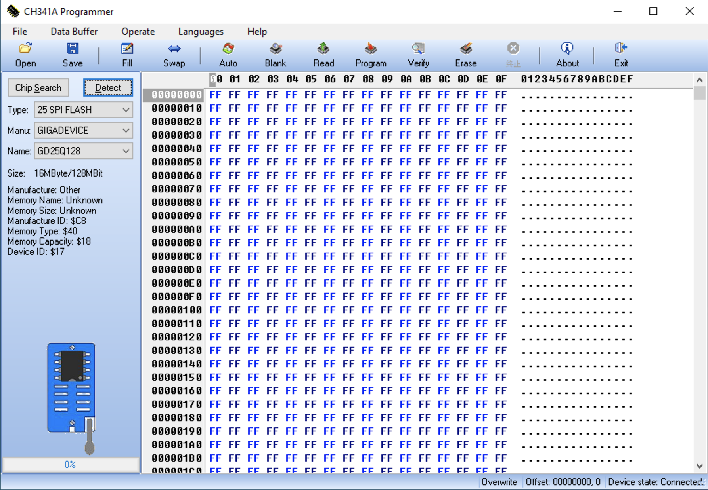
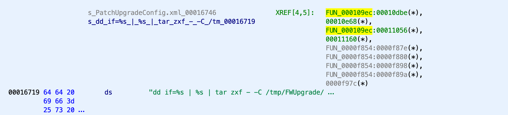
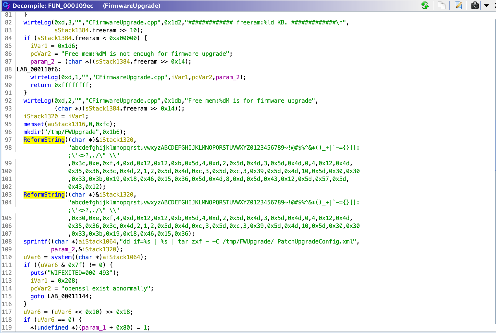
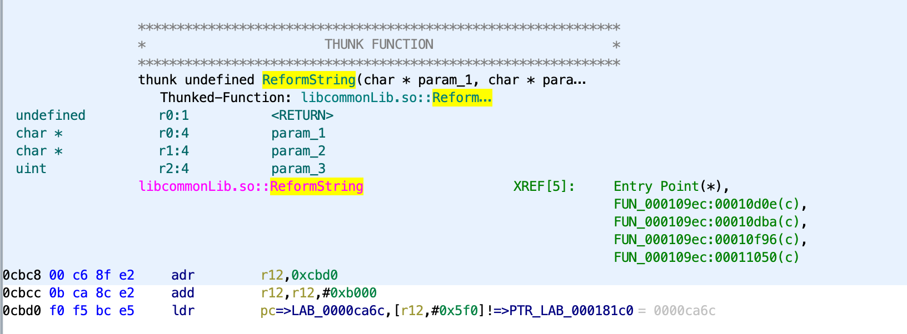
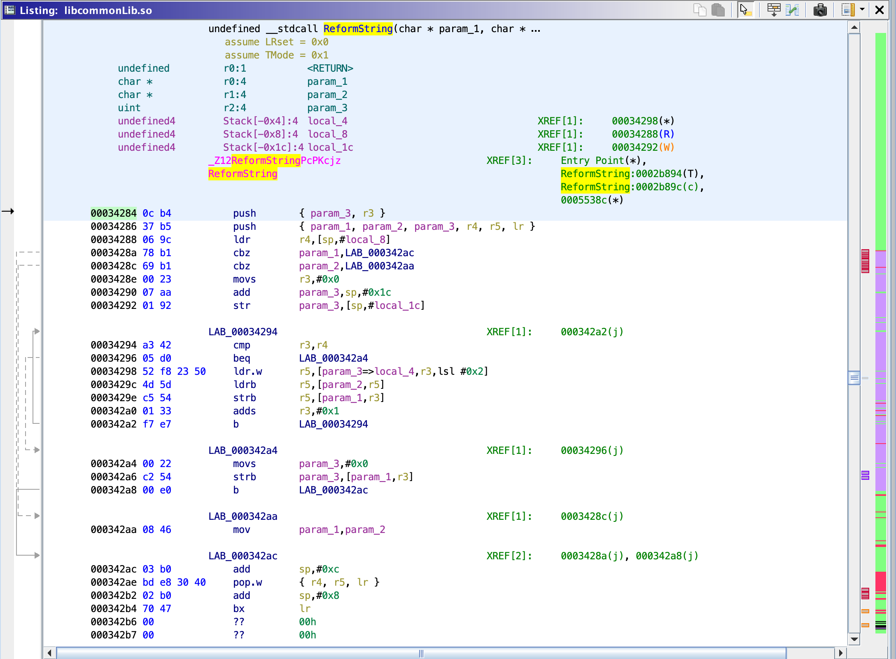

This post will demonstrate how you can use an $14 SPI flash programmer from Amazon to extract firmware from a FOSCAM camera, then reverse engineer the firmware upgrade process to extract the encryption keys that are used to decrypt firmware downloaded from their website. The same method of key extraction can also be used to extract other kinds of passwords that are used by the various libraries in the firmware.

If you would like to download the files we'll be analyzing to follow along, you can get them here: https://mega.nz/file/p9BASSxJ#g8bTOw4Yg7GRr2qZCgKG4q0i7eIyCoFfXCl6lFhS5kY

# Initial investigation from foscam.com firmware

FOSCAM posts the firmware for all of their devices online for public download. I'm using a QJ4 model, so I [downloaded the firmware](https://www.foscam.com/downloads/firmware_details.html?id=145) and ran some initial analysis on it.

Running a `file` command on the downloaded firmware bin file gives us the following output:

```shell{promptUser: josh}{promptHost: laptop}
file FosIPC_J_app_ver2.x.2.63.bin
FosIPC_J_app_ver2.x.2.63.bin: openssl enc'd data with salted password
```

Now we know the firmware is encrypted with openssl, using some sort of salted password. We should expect that we won't see any strings of value and running `binwalk` shouldn't give us anything.

```shell{promptUser: josh}{promptHost: laptop}
strings FosIPC_J_app_ver2.x.2.63.bin
Salted__G
1)4cu
]eTZ
vOv@
sRc-
|ag4
I kH
i@.U
7F"/
$1hl
8)Z7X
/T,v
.7C5w
RBtM

binwalk FosIPC_J_app_ver2.x.2.63.bin

DECIMAL       HEXADECIMAL     DESCRIPTION
--------------------------------------------------------------------------------
0             0x0             OpenSSL encryption, salted, salt: 0x47A7AC8464AEB38F
6946217       0x69FDA9        MySQL MISAM compressed data file Version 1
```

# Extracting firmware via SPI flash programmer

<div class="info-block info">
    <p>
    <b>Update</b>  &rarr; I found out that FOSCAM offers recovery images if you send them an email to support[at]foscam[dot]com, tell them you're having trouble with your camrea and need a recovery image, they'll send you a link to an archive that contains a few files, one of which is the <code>FirmwareUpgrade</code> file for whatever model you have, which we end up reverse engineering encryption keys from in the next section. If you get this file from them, you can skip this section.<br>
    </p>
</div>

Taking apart the camera reveals a few layers of boards that have a variety of different chips, the chip that we're looking for is going to be an SPI flash chip, in this case, a [*GigaDevice GD25Q64CSIG*](https://www.mouser.com/ProductDetail/GigaDevice/GD25Q64CSIG?qs=RcG8xmE7yp1fNNepEtzjlg%3D%3D) chip. 



Looking at the datasheet we see the following layout:


We can use a [$14 SPI flash programmer from Amazon](https://www.amazon.com/gp/product/B07SHSL9X9/ref=ppx_yo_dt_b_search_asin_title?ie=UTF8&psc=1) to clip onto this chip and use the [CH341A software](https://iowin.net/en/ch341a-programmer-en/) to read from the chip.

Make sure all contacts from the SOIC8 clip are fitted onto the GigaDevice flash chip, with the red wire clipped onto rail 1 (`CS#` in the diagram). Make sure the programmer side of the clip is fitted with the red wire in the lower top left region if you're holding the USB part upright, as shown in this image:


Open the CH341A software and make sure it detects your USB programmer by looking for the *Connected* text in the bottom right, fill out manufacturer and type of chip we're connecting to, and click *Detect*. As long as you see the *Manufacture ID*, *Memory Type*, *Memory Capacity*, and *Device ID* show values **other than** `$FF` then you should have a good connection.



Click *Read* at the top and wait for ~10 minutes for the chip to be read. Once it's done, you can save the output by clicking *Save* and naming it `firmware-extract.bin`.

# Using `binwalk` to extract firmware contents

Now we can run `binwalk -eM firmware-extract.bin` to see what's inside.

<div class="ascii-player" data-path="/asciinema/foscam-firmware-extract.cast"></div>

Poking around the firmware, we see some interesting things:

```shell{promptUser: josh}{promptHost: laptop}
find . -type f -name "*.pem"
./dhparams.pem
./foscloud-client.pem
./iot-client-key.pem
./squashfs-root/mtd/app/etc_upgrade/foscam/dhparams.pem
./squashfs-root/mtd/app/etc_upgrade/foscam/foscloud-client.pem
./squashfs-root/mtd/app/etc_upgrade/iot-client-key.pem
./squashfs-root/mtd/app/etc_upgrade/sm_cn_private.pem
./sm_cn_private.pem
find . -type f -name "*Firmware*"
./squashfs-root/mtd/app/bin/FirmwareUpgrade
./FirmwareUpgrade
```

That `FirmwareUpgrade` file looks like it might be exactly what we're looking for.

# Reverse engineering the firmware upgrade process

Load the `FirmwareUpgrade` file into [Ghidra](https://ghidra-sre.org/), see that it picks up a *Generic ARM/Thumb V8 little endian* file type, and perform the basic analysis on it.

Searching through the strings for the term "*upgrade*" we come across this string: `dd if=%s | %s | tar zxf - -C /tmp/FWUpgrade/ PatchUpgradeConfig.xml` we see here that it's calling out to `dd`, setting a parameterized input file, then executing some other parameterized command, then running a tar extract. Going to the address the string is at, `00016719`, we see a reference to a function called `FUN_000109ec`.



Clicking into that function where the string is referenced and opening the *Decompiler* window, we get the following:



This code looks like it's doing some sort of string formatting in the `ReformString` function, and adding it to the `dd` string command as the second parameter. Unfortunately when we click `ReformString`, we see there is no data in this file because the method is actually defined in a different file called `libcommonLib.so`:



Searching through the `binwalk` extract for this file gives us the following:

```shell{promptUser: josh}{promptHost: laptop}
find . -type f -name "libcommonLib.so"
./squashfs-root/mtd/app/basic_lib/libcommonLib.so
./libcommonLib.so
```

Now we can load `libcommonLib.so` into Ghidra, perform basic analysis, and do a search for the `ReformString` method, we find it at address `00034284`. The assembly looks like this:



And the decompiler has this:

```c
/* ReformString(char*, char const*, unsigned int, ...) */
char * ReformString(char *param_1,char *param_2,uint param_3,...)

{
  char *pcVar1;
  int in_r3;
  uint uVar2;
  int local_4;
  
  local_4 = in_r3;
  pcVar1 = param_1;
  if ((param_1 != (char *)0x0) && (pcVar1 = param_2, param_2 != (char *)0x0)) {
    for (uVar2 = 0; uVar2 != param_3; uVar2 = uVar2 + 1) {
      param_1[uVar2] = param_2[(&local_4)[uVar2]];
    }
    param_1[uVar2] = '\0';
    pcVar1 = param_1;
  }
  return pcVar1;
}

```

This function doesn't look like it does anything *too* complicated. Rewriting it in python, taking the resulting buffer, and combing it as a string would look something like:

```python
def ReformString(charset, length, *args):
    buff = [0] * (length + 1)
    if charset != None:
        for n in range(length):
            buff[n] = charset[args[n]]
        buff[n + 1] = '\0'
    return ''.join(str(x) for x in buff)
```

We can now call the python function with the decompiled code we found back in the `FirmwareUpgrade` file:

```python
result = ReformString(
    "abcdefghijklmnopqrstuvwxyzABCDEFGHIJKLMNOPQRSTUVWXYZ0123456789~!@#$%^&*()_+|`-={}[]:;'<>?,./\" \\",
    0x3c,
    0xe,0xf,4,0xd,0x12,0x12,0xb,0x5d,4,0xd,2,0x5d,0x4d,3,0x5d,0x4d,0,4,0x12,0x4d,
    0x35,0x36,0x3c,0x4d,2,1,2,0x5d,0x4d,0xc,3,0x5d,0xc,3,0x39,0x5d,0x4d,10,0x5d,0x30,0x30,
    0x33,0x3b,0x19,0x18,0x46,0x15,0x36,0x5d,0x4d,8,0xd,0x5d,0x43,0x12,0x5d,0x57,0x5d,
    0x43,0x12
)

print(result)
# openssl enc -d -aes-128-cbc -md md5 -k WWZ7zy*v2 -in %s > %s
```

Running the script reveals that the password for this firmware is `WWZ7zy*v2` - we can test this by using the same command given to us in the output, and running it on the firmware we downloaded from the website:


```shell{promptUser: josh}{promptHost: laptop}
openssl enc -d -aes-128-cbc -md md5 -k "WWZ7zy*v2" -in FosIPC_J_app_ver2.x.2.63.bin > decrypted-firmware.bin
```

And then running `binwalk -eM decrypted-firmware.bin` outputs a filesystem that looks almost identical to what we extracted from the flash chip.

<div class="ascii-player" data-path="/asciinema/foscam-decrypted-firmware.cast"></div>

# Bonus points

Now that we have the key extraction script written in python, we can search through all of the other files to try to find other places that `ReformString` is being used. I wrote a script that I called `findtext` that has the following:

```bash
echo "Searching files for '$1'"
for entry in $(find . -type f -name "*"); do
    if grep -q -- $1 <<< $(strings $entry); then
        echo "Found text in: $entry"
    fi
done
```

And when I run: `findtext "ReformString"`, I get the following results:

```shell{promptUser: josh}{promptHost: laptop}
findtext "ReformString"
Searching files for 'ReformString'
Found text in: ./_0.extracted/_mtd.sqfs.extracted/squashfs-root/mtd/app/bin/webService
Found text in: ./_0.extracted/_mtd.sqfs.extracted/squashfs-root/mtd/app/bin/FirmwareUpgrade
Found text in: ./_0.extracted/_mtd.sqfs.extracted/squashfs-root/mtd/app/bin/UDTMediaServer
Found text in: ./_0.extracted/_mtd.sqfs.extracted/squashfs-root/mtd/app/basic_lib/libEncrypt.so
Found text in: ./_0.extracted/_mtd.sqfs.extracted/squashfs-root/mtd/app/basic_lib/libcommonLib.so
Found text in: ./2FE36E
Found text in: ./46C045
```

We can search through these files for other functions that use the same method of key decoding. These are all of the references and decoded keys I found:

### webService

```
FUN_00019444:00019788 - openssl enc -d -aes-128-cbc -k U0i*P2jK_ -in %s > %s
FUN_00019444:000198fa - openssl enc -d -aes-128-cbc -md md5 -k Ktf1g* -in %s > %s
FUN_0001a48c:0001a4e2 - factory~
FUN_000264e8:00026532 - factory~
FUN_000264e8:00026558 - Ak47@99
FUN_00033eb4:000340dc - openssl enc -aes-128-cbc -k U0i*P2jK_ -in /tmp/www/configs/export/configs.tar.gz -out /tmp/www/configs/export/configs.bin
FUN_0003cb68:0003cd1a - cmd=cgiKeepAlive&usr=factory~&pwd=Ak47@99
FUN_0004f6d8:0004f718 - foscam123
```

### UDTMediaServer

```
CP2PTutk::logInThreadFunc:00046e68 - admin
CP2PTutk::logInThreadFunc:00046e88 - foscam
FUN_00048cfc:00048d44 - foscam123
```

### libEncrypt.so

```
CEncFile::CEncFile:0001208c - M0i*P2jK_
```

### libcommonLib.so

```
WriteLogShmBuffToFile:00034476 - cd /tmp/ && tar zcf - ipc.log | openssl des3 -salt -k rizhi6789 | dd of=/mnt/app_ext/ipcLog.bin
SendLogThreadFunc:000348d0 - cd /mnt/app_ext/ && dd if=ipcLog.bin | openssl des3 -d -k rizhi6789 | tar -zxf - -C /tmp/
SendLogThreadFunc:00034a56 - cd /mnt/app_ext/ && dd if=ipcLog.bin | openssl des3 -d -k rizhi6789 | tar -zxf - -C /tmp/
CEncFile:0003b198 - M0i*P2jK_
setRsaPrivateKeyByPem:0003b6b0 - blm171FQtQp7sr3J
```