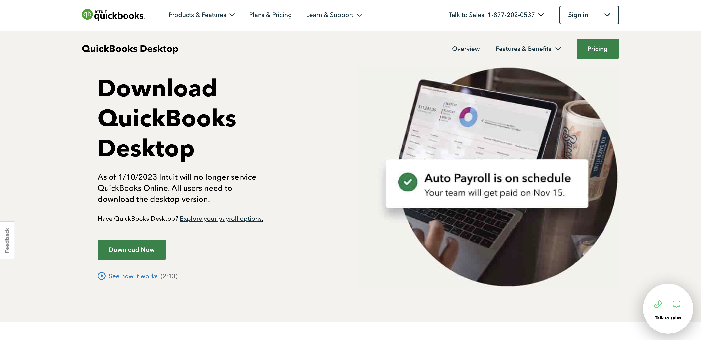
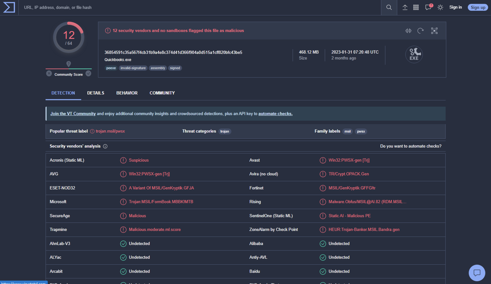
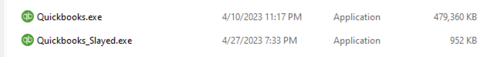
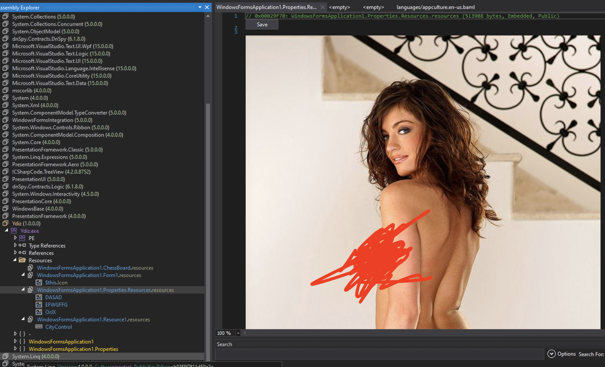
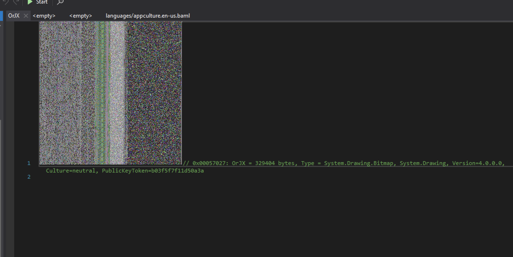
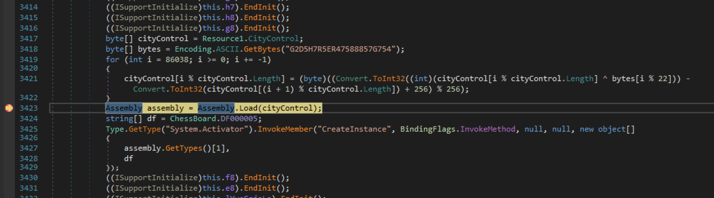
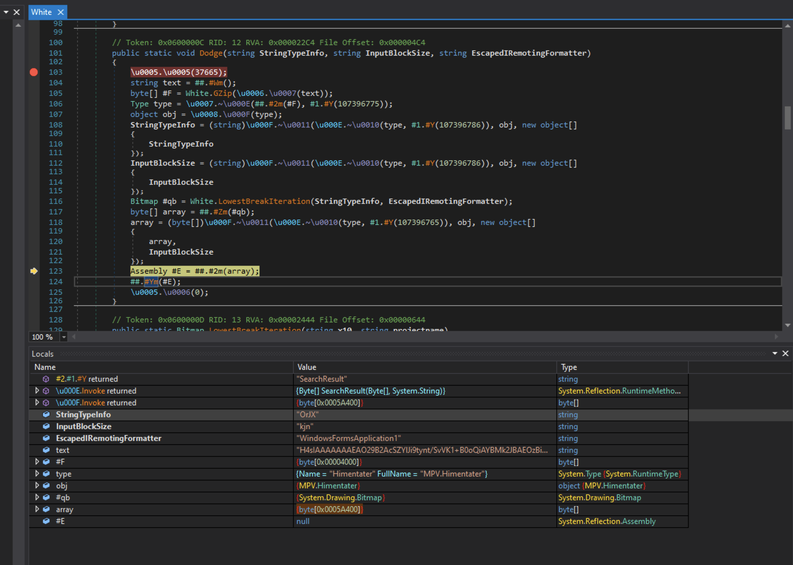
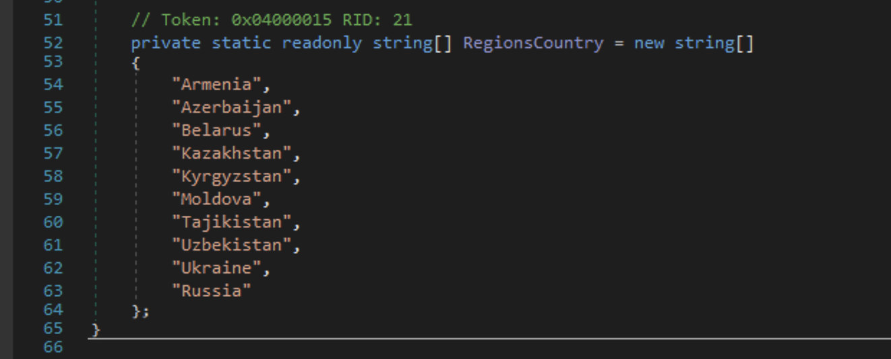
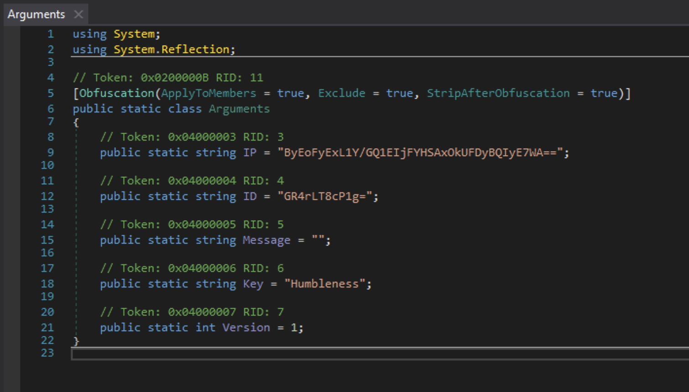
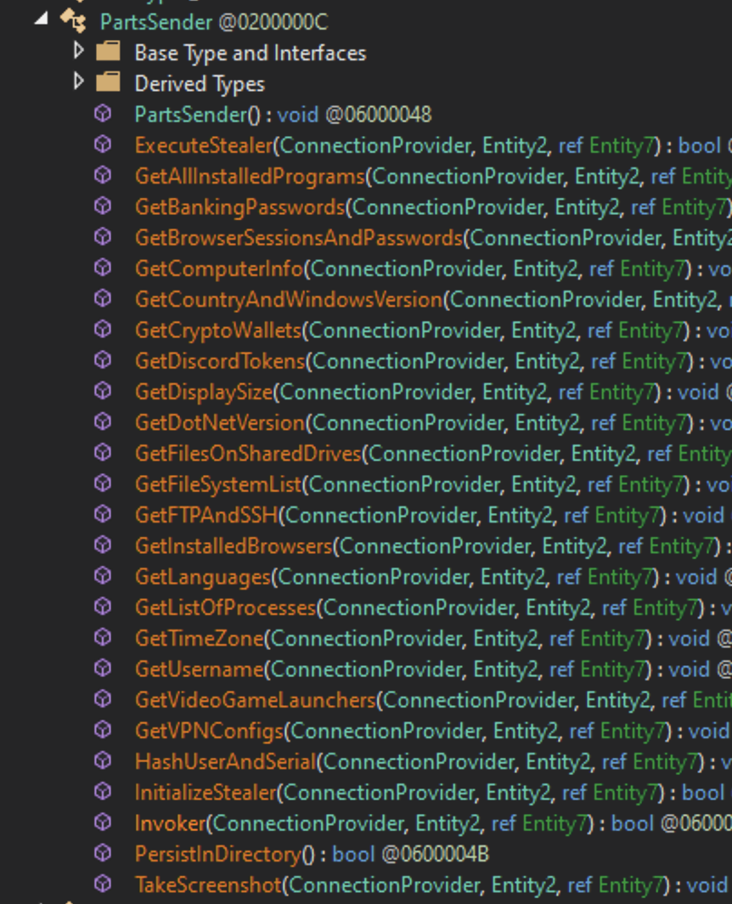

Using ICANN zone files, we can search all active domains for fraudulant sites that have a smiliar domain and look-and-feel of legitimate products they're trying to copy. These fake sites offer downloads to software that look real, but have malware attached. In this article, we'll look at a fake Quickbooks site offering a download which contains the infamous [Redline Stealer](https://malpedia.caad.fkie.fraunhofer.de/details/win.redline_stealer).

If you would like to download the files we'll be analyzing to follow along, you can get them here: https://mega.nz/file/UpZgBKgb#8RNWAptOWzGkjqvdVaNn-5rLOz8R4XHkfvocOsxjO9M

# How to find fraudulant sites

ICANN is the internet's governing body that controls all domain TLD's, from the public .com, .net, .org, etc. to private ones registered by companies, like .audi, .nike, etc. Creating an account with ICANN [here](https://account.icann.org/registeraccount) allows you to apply for access to a list of all active domains for specific TLD's (aka *zone files*). Once you've gone [here](https://czds.icann.org/zone-requests/all) to select the zone files you'd like to search, you'll go through an application process that asks your personal information and what you intend on doing with the data. Most TLD's will be approved within minutes to hours, some will take longer like 1-3 days. I applied for access to every TLD they offerered and over the course of two weeks, 99% of them had been approved.

If you don't want to go through ICANN, you can buy a one-month subscription to a site like [zonefiles.io](https://zonefiles.io). 

# Searching the zone files

Depending on where you get the zone files, they can be as large as 7GB+ gzipped. A trick I found to be able to search through these large zip files without extracting them is running a command like:

```shell
gunzip -c ALLZONES_zone_full.gz | grep "quickbooks" > quickbooks-domains.txt
```

Resulting in files like this:

`gist:joshterrill/38891d0eb2c1b15617e4a1abfc15b7a9#quickbooks-domains.txt`

Going through these domains, we see that there are three categories:

1. It's a domain that the actual company owns, and they just own it so no one else can have it. These likely will redirect back to the main company website.

2. It's a domain that is parked and goes nowhere, or doesn't resolve to anything.

3. It's a domain that looks identical to the real product site, but isn't owned by the company, and is being used to spread downloads of the product with malware in it.

We can write some simple javascript that loops through these domains and finds the ones that likely fall into the third category that we're interested in.

`gist:joshterrill/38891d0eb2c1b15617e4a1abfc15b7a9#domain-verification.js`

Running this script through our list shrinks the results down significantly:

`gist:joshterrill/38891d0eb2c1b15617e4a1abfc15b7a9#quickbooks-domains-results.txt`

# Analyzing Quickbooks malware

Using the same methods of finding fake malicious sites, a few Quickbooks domains came up that were trying to pass themselves off as being legit, but were serving malicious `Quickbooks.exe` files. In this case, the one we'll be looking at is: `http://quickbooks-online.biz`. 

Here's what the site looks like at the time of writing the article:



And Virus Total shows the following for the executable: https://www.virustotal.com/gui/file/36854591c35a567f4cb31b9a4e8c374d41d366f904a0d515a1cff820bfc43be5



Running the exe through Detect It Easy (DIE) shows that it is obfuscated by Eazfuscator. Using NetSlayer, we can deobfuscate it and open the resulting `Quickbooks_Slayed.exe` file in dnSpy. One thing to notice is the difference in filesize between the original and the unpacked versions.



# Stage 1 - Debugging `Quickbooks.exe`

TODO: get screenshots of the embedded "chess" game

After loading it in dnSpy, there are a few intersting image resources...

An image of a porn-star in resources called `DASAD` and `EFWGFFG`:



What *looks like* compressed data, being represented as an image called `OrJX`:



And another resource called `CityControl` that is 46,008 bytes. We can save these files for further analysis.

References to `CityControl` were found using the *Search Assemblies* tool (CTRL+SHIFT+K), and breakpoints were applied where the resource is referenced - now we can start the debugger.

Once the breakpoint is hit, we see code where a magic string of `"G2DH5H7R5ER47588857G754"` is used to decrypt the contents of the resource byte by byte, then it loads the result into memory through `Assembly.Load()`.



If we stop the debugger after the decryption has occurred but before `Assembly.Load(cityControl)` is called, we can right-click on the `cityControl` local variable and save it into a new file called  `CityControl-decrypted`. Loading this new file into DIE shows that it's a DLL file protected by Smart Assembly. Running this new binary through `NetSlayer`, then loading it into dnSpy shows that it's called `Tigra.dll`.

# Stage 2 - Reversing `Tigra.dll`

Virus Total: https://www.virustotal.com/gui/file/411569f9f0b865c651adc1234d23f86cd98fe5cd641704702276e9882be113b6

This DLL has a 18,057 byte resource called `{5412f298-bf84-4a62-92cd-0cda7baed9f5}` which appears to have some base64-encoded strings with several different kinds of separators that decode to:

  * HPV.Himentater
  * CausalitySource
  * SearchResult
  * Properties.Resource
  * Ver
  * Invalid file header
  * Unsupported file version
  * Unknown index type found
  * \<long base64 encoded string>

Looking through the classes, we find a reference to this resource in `Class3` that loads it into a stream. Starting the debugger on `Quickbooks.exe` again, this time stepping into the `.InvokeMember("CreateInstance")` method show in the screenshot above, brings us to a method inside `Tigra.dll` called `Dodge()` in the `Scraper.White` namespace.



The reversed psuedo-code might look something like this:

```dotnet
/*
StringTypeInfo = "4F724A58"
InputBlockSize = "6B6A6E"
EscapedRemotingFormatter = "WindowsFormApplication1"
*/
public static void Dodge(string StringTypeInfo, string InputBlockSize, string EscapedRemotingFormatter)
{
    Thread.Sleep(37665) // sleep for 37 seconds
    string text = LoadResourceAndParseReversedTextAndDecode(); // "H4slAAAAAAAEAO29B2AcSZij9ynt......";
    byte[] decompressed = White.Gzip(base64Decode(text));
    Type type = Assembly.GetType(Assembly.Load(decompressed)); // {Name="Himentater", FullName="MPV.Himentater"}
    object obj = Activator.CreateInstance(type);
    StringTypeInfo = obj.CasualitySource(StringTypeInfo); // returns 'OrJX'
    InputBlockSize =  obj.CasualitySource(InputBlockSize); // returns 'kjn'
    Bitmap bmp = White.LowestBreakIteraction(StringTypeInfo, EscapedRemotingFormatter); // calls ResourceManager load on 'OrJX'
    byte[] array = ConvertBitmapToByteArray(bmp);
    array = obj.SearchResult(array, InputBlockSize); // converts the array to "Collins.dll"
    Assembly collins = Assembly.Load(array);
    collins.BuildNewPE(); // builds "Decrassifier.exe"
    Environment.Exit(0);
}
```

It loads the base64 encoded resource file called `{5412f295-bf84-4a62-92cd-0cda7baed9f5}`, does some algorithms to decode the data, and then sends it through `White.GZip()` to uncompress. The result is a PE file called `Inspector.dll`.

After `Inspector.dll` is loaded, the strange looking image file we found in `Quickbooks.exe` called `OrJX` is loaded into a Bitmap object and parsed into a byte array that when saved to a file, gives us a PE file called `Collins.dll`.

# Stage 3 `Inspector.dll` and `Collins.dll`

## `Inspector.dll`

Virus Total: https://www.virustotal.com/gui/file/ff1b42ea7d56a37eae801adbddb7116f52a4664c0b41302736f522852edc2747

Once `Inspector.dll` is loaded into memory, a constructor is fired off that parses a resource called `{22dc5f59-9286-486a-b038-04077d50a92d}` which has several base64 strings that decode to the following:

* directoryPath
* DirectoryPath is not relative.
* path
* FilePath is not relative.
* Failed to roll back.
* TransactionalIO

The last string, TransactionalIO is then combined with the victim's temp directory, possibly to create a file later on that is used to store transactional data.

The DLL then goes through some decryption methods that take the incoming `StringTypeInfo` and `InputBlockSize` variables and converts the original values of `"4F724A58"` and `"6B6A6E"` to `"OrJX"` and `"kjn"`. These values are then used to load the image resource called `OrJX` from the original `Quickbooks.exe`. It looks like this:

<div class="override-width" style="max-width: 350px; margin: auto;">
    
</div>

The image is converted to a bitmap object, and then run through an algorithm that extracts another PE called `Collins.dll`.

## `Collins.dll`

Virus Total: https://www.virustotal.com/gui/file/e6219716a7056216acf11552f292598051c9cd5689009c7f48c7fcf94ec11684 (First-time upload to Virus Total)

After `Collins.dll` is loaded into memory, a method at `cypDwx5HfbgULZ6J7r.eEyrTPH05UmRT25qTM.ltqp2KDBJj` is called which has a large switch/case statement with many branching passes and a lot of recursion. It appears the only thing that this DLL is responsible for is to load its embedded resources, parse them through a custom algorithm, and outputs another PE file called `Decrassify.exe`. The contents of this PE are loaded into a newly spawned process which has the same name as the original file: `Quickbooks.exe`.

# Stage 4: `Decrassify.exe`

Virus Total: https://www.virustotal.com/gui/file/07c3f7139f9a76bb1ea788ef9c55eb00bf617f5c5e7c8006cf13564f99edcb58 (First-time upload to Virus Total)

Looking at Virus Total, it becomes apparent that this malware is called [Redline Stealer](https://malpedia.caad.fkie.fraunhofer.de/details/win.redline_stealer) and this executable is the final stage and where all of the malicious functionality exists. Loading `Decrassify.exe` into dnSpy reveals that the purpose of this executable is to steal sensitive information off your computer via a meriad of different methods and techniques that we'll go into.

The first method that is called is `Program.WriteLine()` - we see a call to `Check()` which checks to see if the victim is located in any of these countries:



If the victim resides in any of these countries, the malicious code will *not* execute.

Next we see some functionality that checks for the existence of several different properties from an `Arguments` class as shown here:



The `Program` class takes `Arguments.IP` and `Arguments.Key`, then runs them through a simple base64 + XOR decryption. The result of which is the C2 IP address and port: `91.107.159.152:33685`. An attempt is made to connect to this IP and port, but at the time of writing this article, they were not active. Nmap shows that the IP resolves, but the port is closed. This means the connection loop will continue to run every 5-seconds until a connection is made. We can break out of this loop by making the malware think it has made a connection by overwriting the following variables: `flag3=true` and `flag5=false`.

The last part of this stage takes `Arguments.ID`, decodes it using base64 + XOR, the resulting string equals `PartsSender()`. Finding this method in the disassembly reveals several methods for stealing website passwords, banking information, browsing history, discord tokens, telegram tokens, crypto wallets, information about the infected computer (disk space, total RAM, installed programs, file system list, etc.), FTP's, SSH keys, VPN profiles for ProtonVPN and OpenVPN, and more. The results are then sent in a payload back to the C2 address. Here are what the renamed functions look like:

<div class="override-width" style="max-width: 350px; margin: auto;">
    
</div>

# Conclusion

These are just a couple of examples of how you can find malware in the wild, and as you can imagine, there are hundreds of examples of these fraudulant sites that can be found by searching through zone files. Some other ideas for products to search might be: LastPass, Notepad++, VMWare, TOR Browser, ImgBurn, ExpressVPN, Dropbox, etc. 
