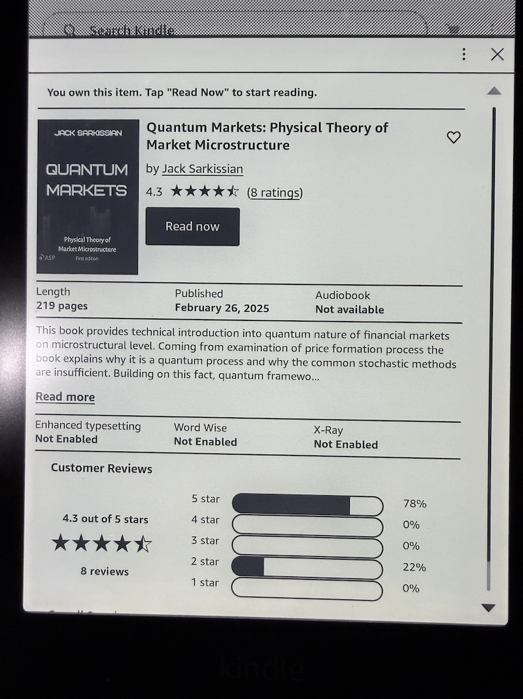
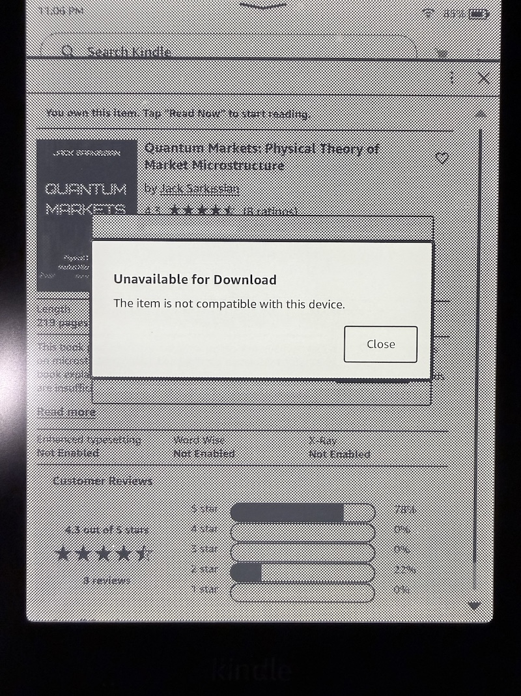
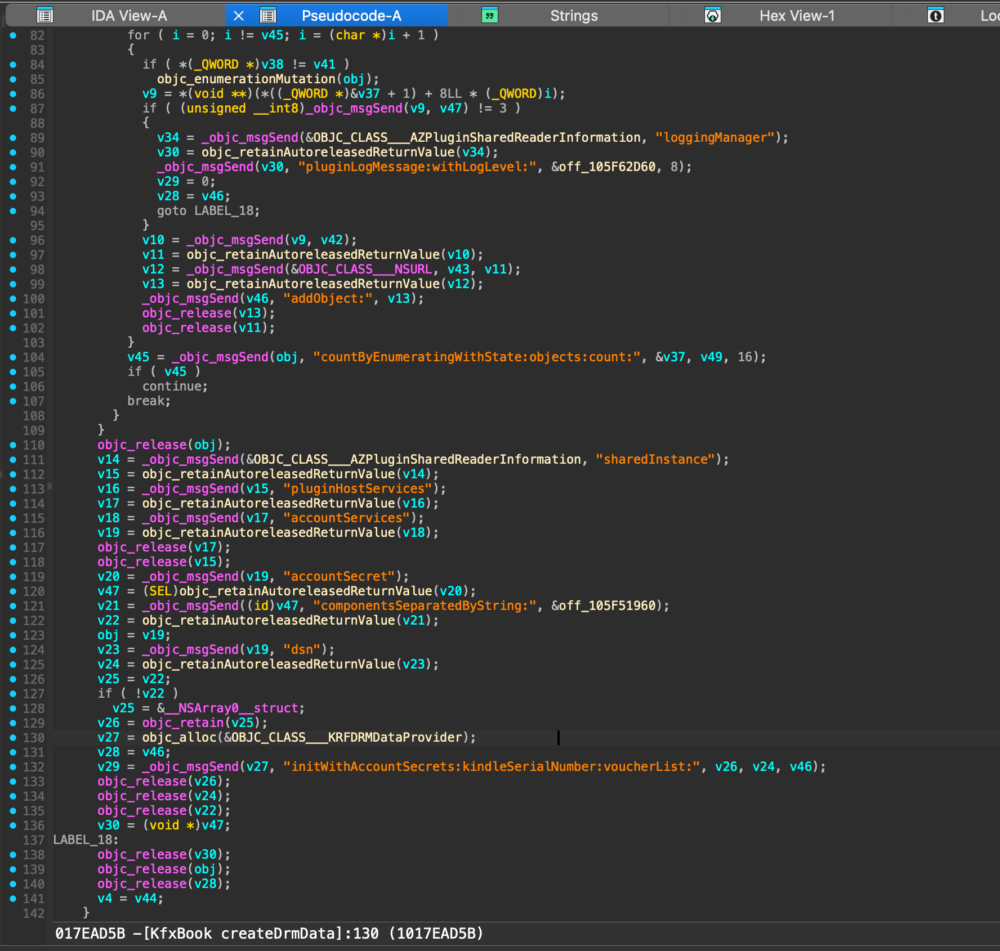
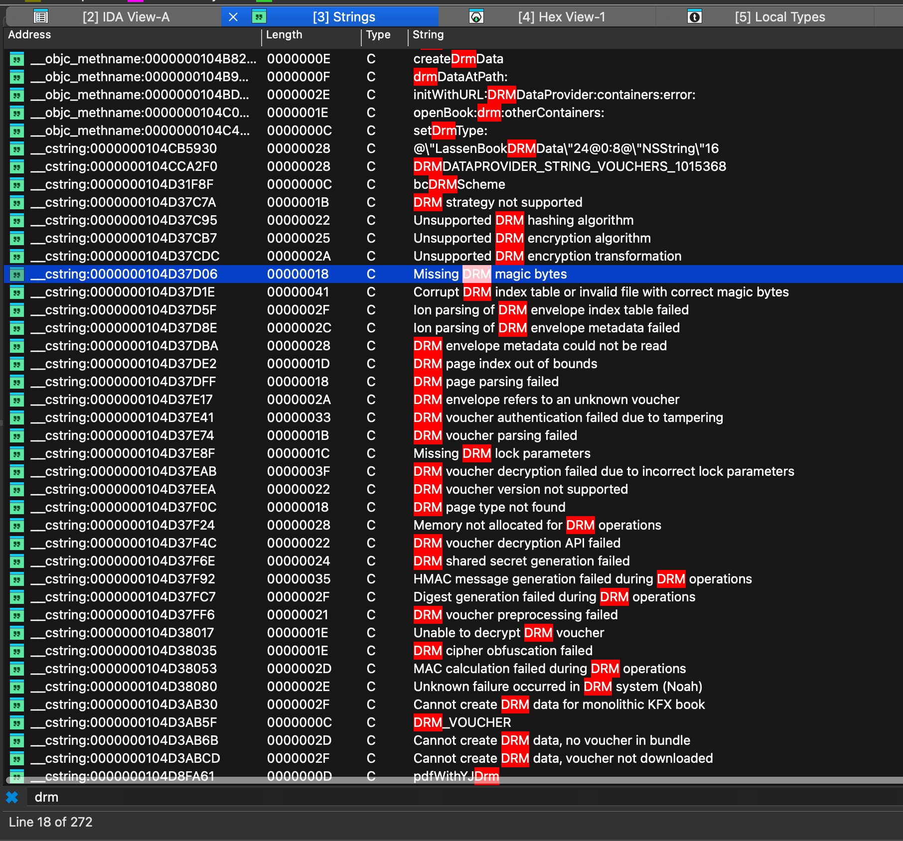
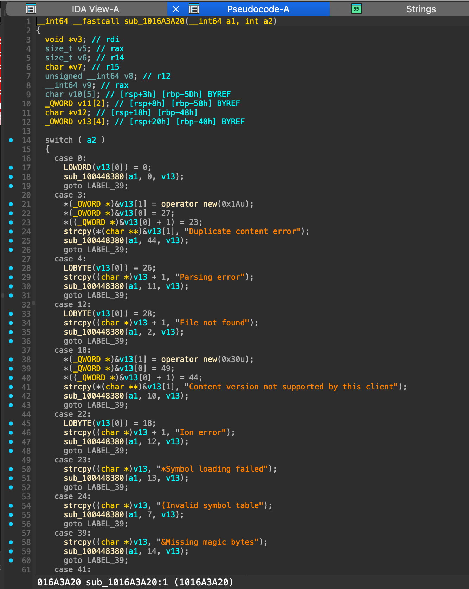
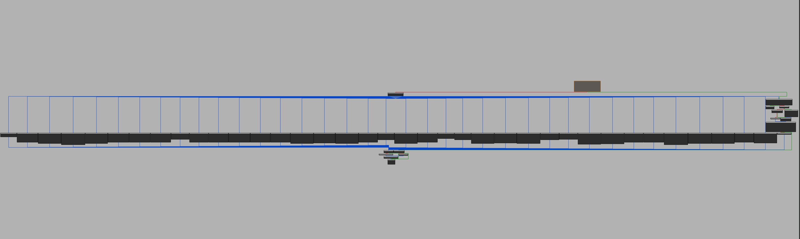
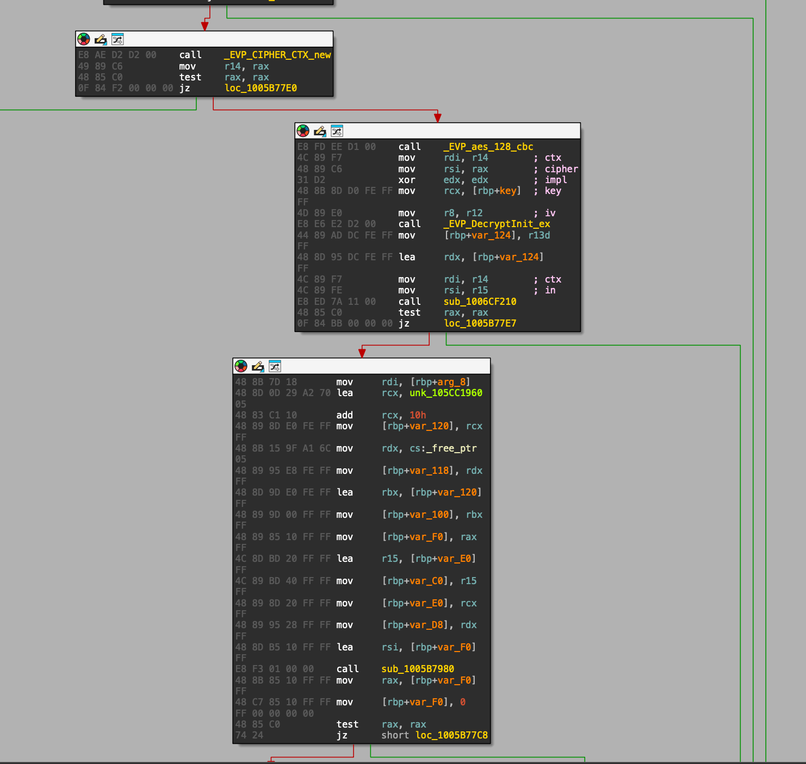
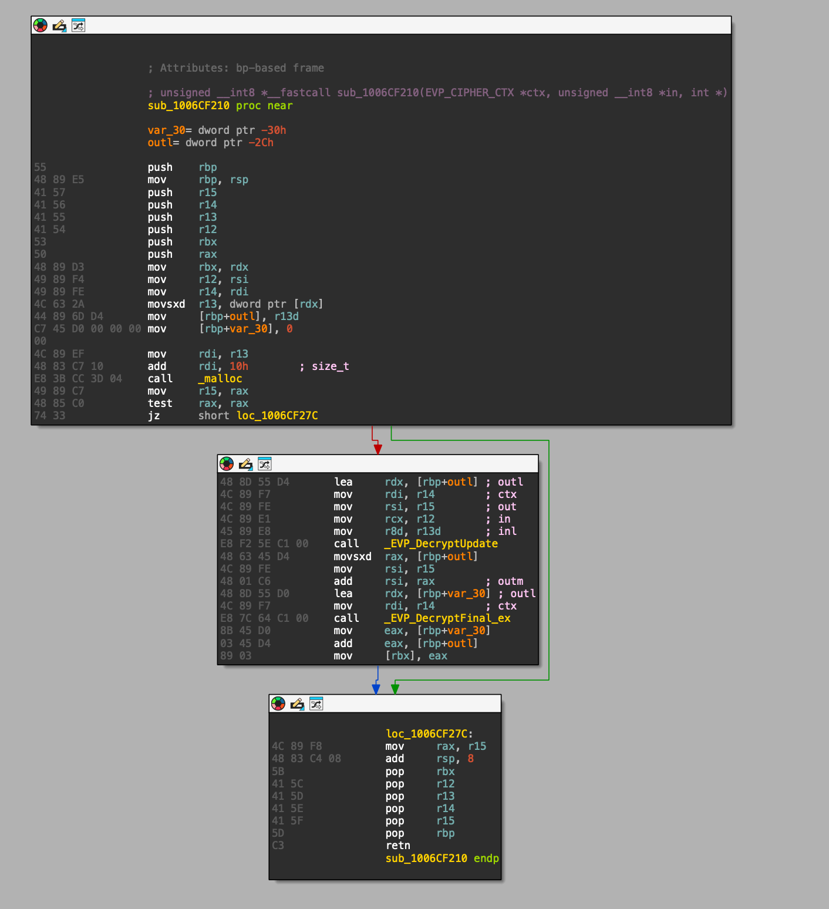
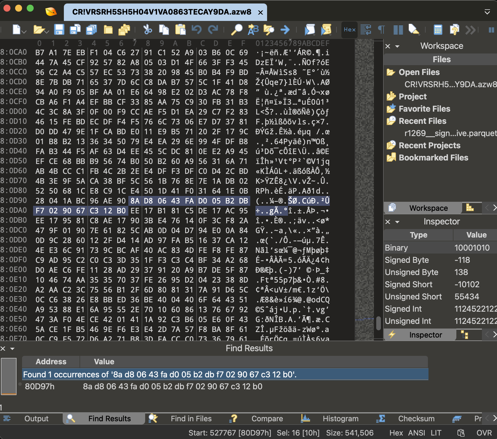
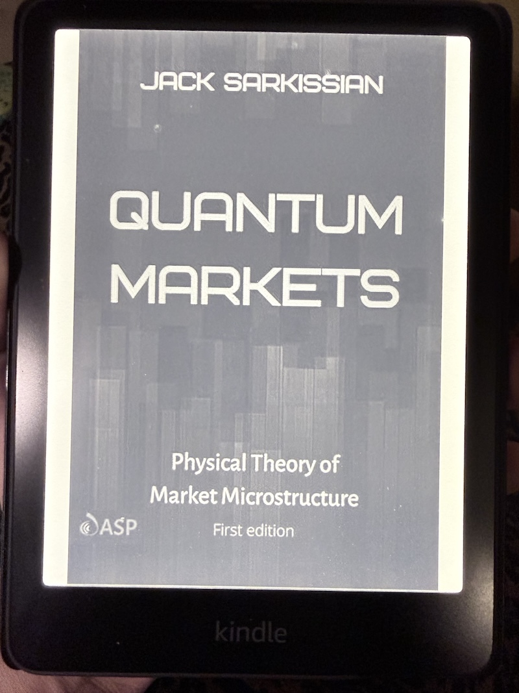

# Preface

The only reason why I've decided to take this project on is because I purchased an expensive technical book on Kindle that I later discovered isn't able to be viewed on my Kindle. I thought this was extremely annoying and decided to reverse engineer the DRM book so I can read my Kindle book on my Kindle.

<div class="info-block danger">
    <p>
        <strong>Disclaimer</strong>  &rarr; This post is for educational purposes only. If you're here to try to pirate Kindle books, go away.
    </p>
</div>

For reference, this is what I'm talking about:

<div class="image-md-container">
    
</div>

And then disappointingly...

<div class="image-md-container">
    
</div>

I am using the Kindle App version: `Version 7.58 (1.437344.10)` on an Apple Silicon macOS `26.5`. All of the reverse engineering is done in x86_64, which I will explain later. I have also opted to obfuscate the keys and any identifiers that I believe could be used to identify the account I was using to test.


# The Kindle filesystem

When a book is downloaded to the Kindle app, it is stored in a container directory here: `~/Library/Containers/com.amazon.Lassen/Data/Library/eBooks/<BOOK_ASIN>/<UUID>/` in several files:

```bash command
ls -harlot
```
```bash output
total 17408
-rw-r--r--@  1 josh    52K Apr 20 00:48 StartActions.data.B0DYNRG1XK.asc
-rw-r--r--@  1 josh   227K Apr 20 00:48 CR!9953X4K20S5YH4JCV0AJTQ4BH1XS.azw9.md
-rw-r--r--@  1 josh   1.1K Apr 20 00:48 amzn1.drm-voucher.v1.b0e319d2-d860-4599-a89d-503315a2e687.voucher
-rw-r--r--@  1 josh   529K Apr 20 00:48 CR!VRSRH5SH5H04V1VA0863TECAY9DA.azw8
-rw-r--r--@  1 josh   3.0M Apr 20 00:48 CR!NCJHJKYV4D20HC6DD7C4TZ3Y97J6.azw9.res
-rw-r--r--@  1 josh   2.0M Apr 20 00:48 CR!AA8YMKW7T97J53NP0NWXDE24SARE.azw9.res
-rw-r--r--@  1 josh   2.6M Apr 20 00:48 CR!DJG5AWVY195EB79HG7KFV1M5XSYH.azw9.res
-rw-r--r--@  1 josh    28K Apr 20 01:03 BookManifest.kfx
-rw-r--r--@  1 josh    31K May 13 23:43 EndActions.data.B0DYNRG1XK.asc
-rw-r--r--@  1 josh     0B May 13 23:46 BookManifest.kfx-wal
-rw-r--r--@  1 josh    32K May 18 02:17 BookManifest.kfx-shm
```

I found these files by running `sudo fs_usage -w -f filesys | grep voucher` while running the Kindle app and opening a book.

Running `file` on all of these files reveals:

```bash command
file *
```
```bash output
amzn1.drm-voucher.v1.b0e319d2-d860-4599-a89d-503315a2e687.voucher: data
BookManifest.kfx:                                                  SQLite 3.x database, last written using SQLite version 3051000, writer version 2, read version 2, file counter 3, database pages 7, cookie 0x5, schema 4, largest root page 7, UTF-8, vacuum mode 1, version-valid-for 3
BookManifest.kfx-shm:                                              data
BookManifest.kfx-wal:                                              empty
CR!9953X4K20S5YH4JCV0AJTQ4BH1XS.azw9.md:                           data
CR!AA8YMKW7T97J53NP0NWXDE24SARE.azw9.res:                          data
CR!DJG5AWVY195EB79HG7KFV1M5XSYH.azw9.res:                          data
CR!NCJHJKYV4D20HC6DD7C4TZ3Y97J6.azw9.res:                          data
CR!VRSRH5SH5H04V1VA0863TECAY9DA.azw8:                              data
EndActions.data.B0DYNRG1XK.asc:                                    JSON data
StartActions.data.B0DYNRG1XK.asc:                                  JSON data
```

Looking at the obvious files first:

```bash command
xxd -r StartActions.data.B0DYNRG1XK.asc | jq . | head
```
```bash output
{
  "bookInfo": {
    "class": "bookInfo",
    "asin": "B0DYNRG1XK",
    "contentType": "EBOK",
    "timestamp": 1778741025772,
    "refTagSuffix": "AHjmAAA",
    "imageUrl": "https://m.media-amazon.com/images/I/41nguZppEFL.jpg",
    "embeddedID": "CR!VRSRH5SH5H04V1VA0863TECAY9DA",
    "fictionStatus": "unknown",
```

And the `sqlite3` file:

```bash command
sqlite3 BookManifest.kfx
.schema
```
```bash output
CREATE TABLE ZKFXBOOKBUNDLEINFO (
  Z_PK INTEGER PRIMARY KEY,
  Z_ENT INTEGER,
  Z_OPT INTEGER,
  ZBOOKID VARCHAR
);

CREATE TABLE ZKFXBOOKPIECE (
  Z_PK INTEGER PRIMARY KEY,
  Z_ENT INTEGER,
  Z_OPT INTEGER,
  ZRAWREQUIREMENTLEVEL INTEGER,
  ZRAWSTATUS INTEGER,
  ZIDENTIFIER VARCHAR,
  ZRELATIVEPATH VARCHAR,
  ZTYPE VARCHAR
);

CREATE TABLE Z_PRIMARYKEY (
  Z_ENT INTEGER PRIMARY KEY,
  Z_NAME VARCHAR,
  Z_SUPER INTEGER,
  Z_MAX INTEGER
);

CREATE TABLE Z_METADATA (
  Z_VERSION INTEGER PRIMARY KEY,
  Z_UUID VARCHAR(255),
  Z_PLIST BLOB
);

CREATE TABLE Z_MODELCACHE (
  Z_CONTENT BLOB
);
```

Querying each table gives the following results:

```bash command
SELECT * FROM ZKFXBOOKBUNDLEINFO;
```
```bash output
1|1|1|A:B0DYNRG1XK-0
```
```bash command
SELECT * FROM ZKFXBOOKPIECE;
```
```bash output
1|2|3|2|3|CR!AA8YMKW7T97J53NP0NWXDE24SARE|Library/eBooks/B0DYNRG1XK/ABD0ED73-68FF-4B72-958F-F5EC1ACD2918/CR!AA8YMKW7T97J53NP0NWXDE24SARE.azw9.res|KINDLE_MAIN_ATTACHABLE
2|2|2|1|3|46008942-e71a-4ced-bd98-1fb5a62df5d9||KINDLE_USER_ANOT
3|2|3|0|3|CR!9953X4K20S5YH4JCV0AJTQ4BH1XS|Library/eBooks/B0DYNRG1XK/ABD0ED73-68FF-4B72-958F-F5EC1ACD2918/CR!9953X4K20S5YH4JCV0AJTQ4BH1XS.azw9.md|KINDLE_MAIN_METADATA
4|2|3|0|3|amzn1.drm-voucher.v1.b0e319d2-d860-4599-a89d-503315a2e687|Library/eBooks/B0DYNRG1XK/ABD0ED73-68FF-4B72-958F-F5EC1ACD2918/amzn1.drm-voucher.v1.b0e319d2-d860-4599-a89d-503315a2e687.voucher|DRM_VOUCHER
5|2|3|0|3|CR!NCJHJKYV4D20HC6DD7C4TZ3Y97J6|Library/eBooks/B0DYNRG1XK/ABD0ED73-68FF-4B72-958F-F5EC1ACD2918/CR!NCJHJKYV4D20HC6DD7C4TZ3Y97J6.azw9.res|KINDLE_MAIN_ATTACHABLE
6|2|3|2|3|CR!DJG5AWVY195EB79HG7KFV1M5XSYH|Library/eBooks/B0DYNRG1XK/ABD0ED73-68FF-4B72-958F-F5EC1ACD2918/CR!DJG5AWVY195EB79HG7KFV1M5XSYH.azw9.res|KINDLE_MAIN_ATTACHABLE
7|2|3|0|3|CR!VRSRH5SH5H04V1VA0863TECAY9DA|Library/eBooks/B0DYNRG1XK/ABD0ED73-68FF-4B72-958F-F5EC1ACD2918/CR!VRSRH5SH5H04V1VA0863TECAY9DA.azw8|KINDLE_MAIN_BASE
```
```bash command
SELECT * FROM Z_PRIMARYKEY;
```
```bash output
1|KfxBookBundleInfo|0|1
2|KfxBookPiece|0|7
```
```bash command
SELECT * FROM Z_METADATA;
```
```bash output
1|F5DFF958-17B9-4310-A2B4-D131601F5241|bplist00�^A^B^C^D^E^F^G^H
^K^M^N^O^P^Q
^V_^P$NSPersistenceMaximumFrameworkVersion_^P^^NSStoreModelVersionIdentifiers[NSStoreType_^P^R_NSAutoVacuumLevel_^P^_NSStoreModelVersionHashesDigest_^P^^NSStoreModelVersionChecksumKey_^P^YNSStoreModelVersionHashes_^P^]NSPersistenceFrameworkVersion_^P NSStoreModelVersionHashesVersion^Q^E�^LPVSQLiteQ2_^PXIhUTyr9AR+K5Eh9eUsxB62nJfpkkBV8twYT1PlFZjyqeVewioAwZ11GBW9IhQs/jkJMzdsOWto82IzetroHgcw==_^P,pidIbZPvQyEzUvC1VFr+FAyYBDfca8p+vvp2/9/xOpI=�^R^S^T^U\KfxBookPiece_^P^QKfxBookBundleInfoO^P �>�[?^L�^H^K�TNU�V^G���^M^V^^��U���^C��gO^P OZ�}
```
```bash command
SELECT * FROM Z_MODELCACHE;
```
```bash output
}Vyp^TU^ZgC��΄
```

This gives us some strings we can search for in the binary later:

- `DRM_VOUCHER`
- `KINDLE_MAIN_BASE`
- `KINDLE_MAIN_METADATA`
- `KINDLE_MAIN_ATTACHABLE`
- `KINDLE_USER_ANOT`

The voucher appears to be similar to other voucher files that I've seen, containing metadata about the encryption of the book, a purchase token, and some restrictions on the client. It is **not** the actual key nor does it contain the key to decrypt the book. It is only there to prove ownership and metadata.

```bash command
xxd amzn1.drm-voucher.v1.b0e319d2-d860-4599-a89d-503315a2e687.voucher
```
```bash output
00000000: e001 00ea ee9e 8183 de9a 86be 97de 9584  ................
00000010: 8d50 726f 7465 6374 6564 4461 7461 8521  .ProtectedData.!
00000020: 0188 217f ee08 cc81 fade 08c7 a4ee ae81  ..!.............
00000030: a7de aaa3 b09e 8341 4553 8f8e 9441 4553  .......AES...AES
00000040: 2f43 4243 2f50 4b43 5335 5061 6464 696e  /CBC/PKCS5Paddin
00000050: 679f 8a48 6d61 6353 4841 3235 36c0 aea0  g..HmacSHA256...
00000060: 7218 4b3a 2c77 c102 f4f4 f34d f9bc 1c4b  r.K:,w.....M...K
00000070: f4d1 cd3a 054d e803 6997 8e63 70b6 f6fc  ...:.M..i..cp...
00000080: c1ae 07ef e001 00ea ee9e 8183 de9a 86be  ................
00000090: 97de 9584 8d50 726f 7465 6374 6564 4461  .....ProtectedDa
000000a0: 7461 8521 0188 217f ee07 c881 adde 07c3  ta.!..!.........
000000b0: a28e b961 6d7a 6e31 2e64 726d 2d76 6f75  ...amzn1.drm-vou
000000c0: 6368 6572 2e76 312e 6230 6533 3139 6432  cher.v1.b0e319d2
000000d0: 2d64 3836 302d 3435 3939 2d61 3839 642d  -d860-4599-a89d-
000000e0: 3530 3333 3135 6132 6536 3837 96ae 90b7  503315a2e687....
000000f0: 517f c245 8658 ec21 c515 c34a 94cd c195  Q..E.X.!...J....
00000100: ae04 8002 ccef 5964 6c45 f45c d48f 5c56  ......YdlE.\..\V
00000110: eb48 d3de d347 62b0 34f7 f4f1 3eeb b6f7  .H...Gb.4...>...
00000120: df7d a4a8 0a6a f571 7786 f9a4 63bc 0119  .}...j.qw...c...
00000130: d70d 4531 b286 f70f 3baa 99cb 2099 f1f9  ..E1....;... ...
00000140: 5ab8 5061 3767 5a46 3508 805f da13 1c72  Z.Pa7gZF5.._...r
00000150: 1c05 16ad 0b0b 51cf b6da 21e7 dcad 5013  ......Q...!...P.
00000160: e37d f696 22d0 dede 4e90 76ac 4489 ffe1  .}.."...N.v.D...
00000170: 5a43 bc59 7708 a9a3 2809 2760 ca3c 6b70  ZC.Yw...(.'`.<kp
00000180: a17d 565e c397 ed4e 1000 58ea cd4d 1d83  .}V^...N..X..M..
00000190: 51a5 4c5e eba7 cbbb 6b18 f1d5 2448 7c0a  Q.L^....k...$H|.
000001a0: b82b a366 c79f a101 3cb2 2baf 11a1 769e  .+.f....<.+...v.
000001b0: db18 ec68 f363 b78c cc9c c0cb 1d14 a43e  ...h.c.........>
000001c0: 24fd e182 c07b a3cf 434f b531 950c 8bdf  $....{..CO.1....
000001d0: 5253 f588 c3bf 194b baf6 752e cf4b 2211  RS.....K..u..K".
000001e0: 0ec5 ba31 3f16 eaa7 af44 93d4 2c11 72d9  ...1?....D..,.r.
000001f0: 19e2 910b 8d4d 46f7 6f77 ca13 160f d510  .....MF.ow......
00000200: 4b46 2585 ae86 982d 5eb8 49a1 9c04 ef03  KF%....-^.I.....
00000210: dc19 2d7d 3858 5a28 0ee4 03f3 be68 26c3  ..-}8XZ(.....h&.
00000220: 79cc 9d71 94cf 4ad9 5fbe e038 284b 9d9b  y..q..J._..8(K..
00000230: b259 6597 4487 2692 4afe ce5c 02e9 9e85  .Ye.D.&.J..\....
00000240: ac9a 2b98 09b2 115b d909 00f2 24a9 2809  ..+....[....$.(.
00000250: 8453 da28 e6d7 23fb 32f5 ab39 6edc b465  .S.(..#.2..9n..e
00000260: a8fc beaa f1de e014 d52d fc7f 5044 ed19  .........-..PD..
00000270: 2850 90b5 bfed ea56 661e 655b ad3b aaac  (P.....Vf.e[.;..
00000280: e041 7f7f 17f1 e8c4 a092 b86a 0273 ec86  .A.........j.s..
00000290: 3213 62ef 60b5 7395 9a1d 7b25 b4f6 b95f  2.b.`.s...{%..._
000002a0: dfbd f135 f70c e9ed 73d3 f54f c472 1141  ...5....s..O.r.A
000002b0: 3d11 722a ae90 43e3 685f 5903 60ee 33ec  =.r*..C.h_Y.`.3.
000002c0: d38e ccaa dccd dd84 8313 8b8e a377 27d5  .............w'.
000002d0: 1cec 98e7 355d 1b50 1f31 4529 5669 dea3  ....5].P.1E)Vi..
000002e0: fbb5 65ce 4d74 385e a87e 5602 3df1 5c49  ..e.Mt8^.~V.=.\I
000002f0: 9976 0a9a 3a16 67d7 6c04 58c1 8831 f416  .v..:.g.l.X..1..
00000300: c428 7bf8 aec0 49a3 326b 0e1f a834 5b23  .({...I.2k...4[#
00000310: 0a60 8bbf 5cd0 ce09 0880 9679 db6e 59c4  .`..\......y.nY.
00000320: cf7f 6bda 5425 b291 1ef3 2e50 51ed 3918  ..k.T%.....PQ.9.
00000330: 5961 3a21 1aad 6ceb 23ad 85d1 f227 e8a8  Ya:!..l.#....'..
00000340: f9a2 c1de 98e1 b6ee 01d2 81ba de01 cdb5  ................
00000350: 8850 7572 6368 6173 65b7 8e01 bf61 7476  .Purchase....atv
00000360: 3a6b 696e 3a32 3a74 706f 426c 2f6b 444a  :kin:2:tpoBl/kDJ
00000370: 6942 3159 702f 6c37 5647 5946 5176 3131  iB1Yp/l7VGYFQv11
00000380: 7954 6539 5631 5a43 5046 645a 5361 6269  yTe9V1ZCPFdZSabi
00000390: 6545 5468 366c 6772 4e50 4276 5a68 6f65  eETh6lgrNPBvZhoe
000003a0: 6a2f 5938 5252 7846 7770 2b4b 6953 4272  j/Y8RRxFwp+KiSBr
000003b0: 4146 3232 5665 704e 5567 6452 5063 3237  AF22VepNUgdRPc27
000003c0: 5267 316d 4436 4154 3837 2f55 6d43 7331  Rg1mD6AT87/UmCs1
000003d0: 3330 394c 6148 7835 5545 4c72 456d 5432  309LaHx5UELrEmT2
000003e0: 6d67 766e 4145 5146 4551 3446 2f46 5839  mgvnAEQFEQ4F/FX9
000003f0: 3232 422b 4c32 5148 5936 4638 513d 3d3a  22B+L2QHY6F8Q==:
00000400: 4e4d 5a35 6636 7a4b 6167 7941 426e 6539  NMZ5f6zKagyABne9
00000410: 5463 7657 664a 3648 7174 673d bdee d481  TcvWfJ6Hqtg=....
00000420: bebe d0de cebb 8e93 636c 6965 6e74 5f72  ........client_r
00000430: 6573 7472 6963 7469 6f6e 73bc beb5 de94  estrictions.....
00000440: b88d 436c 6970 7069 6e67 4c69 6d69 74b9  ..ClippingLimit.
00000450: 8331 3030 de9d b88e 9454 6578 7454 6f53  .100.....TextToS
00000460: 7065 6563 6844 6973 6162 6c65 64b9 8474  peechDisabled..t
00000470: 7275 65                                  rue
```

Running `strings` on the voucher file gives us a more clear picture:

```bash command
strings amzn1.drm-voucher.v1.b0e319d2-d860-4599-a89d-503315a2e687.voucher
```
```bash output
ProtectedData
AES/CBC/PKCS5Padding
HmacSHA256
K:,w
ProtectedData
amzn1.drm-voucher.v1.b0e319d2-d860-4599-a89d-503315a2e687
YdlE
Pa7gZF5
-}8XZ(
1E)Vi
Mt8^
Ya:!
Purchase
atv:kin:2:tpoBl/kDJiB1Yp/l7VGYFQv11yTe9V1ZCPFdZSabieETh6lgrNPBvZhoej/Y8RRxFwp+KiSBrAF22VepNUgdRPc27Rg1mD6AT87/UmCs1309LaHx5UELrEmT2mgvnAEQFEQ4F/FX922B+L2QHY6F8Q==:NMZ5f6zKagyABne9TcvWfJ6Hqtg=
client_restrictions
ClippingLimit
TextToSpeechDisabled
```

The main book payload is split across a few different pieces.

The `KINDLE_MAIN_BASE` via `.azw8`, and three `KINDLE_MAIN_ATTACHABLE` files via `.azw9.res` are wrapped in encrypted DRMION records. The `KINDLE_MAIN_METADATA` via `.azw9.md` is a plaintext container (`CONT`) file that has resource and metadata pointers.

Before this, I've never heard of "ion" before, but it seems to be a [a custom format that Amazon developed](https://amazon-ion.github.io/ion-docs/). From their docs:

> Amazon Ion is a richly-typed, self-describing, hierarchical data serialization format offering interchangeable binary and text representations. The text format (a superset of JSON) is easy to read and author, supporting rapid prototyping. The binary representation is efficient to store, transmit, and skip-scan parse. The rich type system provides unambiguous semantics for long-term preservation of data which can survive multiple generations of software evolution.

I read a lot about the Ion format...

- Ion binary encoding: https://amazon-ion.github.io/ion-docs/docs/binary.html

- Ion symbols and symbol tables: https://amazon-ion.github.io/ion-docs/docs/symbols.html

And am already cringing at the thought of having to implement a parser for this... more on that later.

# Static analysis

The Kindle app on macOS ships with both Apple Silicon (arm64) and Intel (x86_64) binaries.

```bash command
file /Applications/Kindle.app/Contents/MacOS/Kindle
```
```bash output
/Applications/Kindle.app/Contents/MacOS/Kindle: Mach-O universal binary with 2 architectures: [x86_64:Mach-O 64-bit executable x86_64] [arm64]
/Applications/Kindle.app/Contents/MacOS/Kindle (for architecture x86_64):	Mach-O 64-bit executable x86_64
/Applications/Kindle.app/Contents/MacOS/Kindle (for architecture arm64):	Mach-O 64-bit executable arm64
```

Even though I'm on an Apple Silicon machine, I decided to analyze the x86_64 version of the binary because I am more familiar with that instruction set. I extracted it via [`lipo`](https://ss64.com/mac/lipo.html):

```bash command
lipo -thin x86_64 /Applications/Kindle.app/Contents/MacOS/Kindle -output Kindle_x86_64
```

Then loaded it into IDA.

<div class="info-block info">
    <p>
        <strong>Info</strong>  &rarr; All static analysis in this section assumes a base address of <code>0x100000000</code>
    </p>
</div>

Searching for `DRM_VOUCHER` seemed like a good place to start with static analysis, we find that it's referenced one time in `createDrmData`:

```nasm
__text:00000001017EAA08 ; id __cdecl -[KfxBook createDrmData](KfxBook *self, SEL)
__text:00000001017EAA08 __KfxBook_createDrmData_ proc near      ; DATA XREF: __objc_const:00000001060D2BE0↓o
__text:00000001017EAA08
__text:00000001017EAA08 var_130         = byte ptr -130h
__text:00000001017EAA08 var_128         = qword ptr -128h
__text:00000001017EAA08 var_120         = xmmword ptr -120h
__text:00000001017EAA08 var_110         = xmmword ptr -110h
__text:00000001017EAA08 var_100         = xmmword ptr -100h
__text:00000001017EAA08 var_F0          = qword ptr -0F0h
__text:00000001017EAA08 var_E8          = qword ptr -0E8h
__text:00000001017EAA08 var_E0          = qword ptr -0E0h
__text:00000001017EAA08 var_D8          = qword ptr -0D8h
__text:00000001017EAA08 var_D0          = qword ptr -0D0h
__text:00000001017EAA08 var_C8          = qword ptr -0C8h
__text:00000001017EAA08 var_C0          = qword ptr -0C0h
__text:00000001017EAA08 obj             = qword ptr -0B8h
__text:00000001017EAA08 var_B0          = byte ptr -0B0h
__text:00000001017EAA08 var_30          = qword ptr -30h
__text:00000001017EAA08
__text:00000001017EAA08                 push    rbp
```

This section of decompiled code looks promising:



This code shows us that the voucher alone is likely not enough to decrypt the book. The decryption key is possibly derived from a combination of account secrets, a kindle serial number (DSN), and the voucher file. These are put into a `KRFDRMDataProvider` object.

```c
v27 = objc_alloc(&OBJC_CLASS___KRFDRMDataProvider);
v28 = v46;
v29 = _objc_msgSend(v27, "initWithAccountSecrets:kindleSerialNumber:voucherList:", v26, v24, v46);
```

Or with some renamed variables for clarity:

```c
objc_msgSend(allocatedProvider,
             "initWithAccountSecrets:kindleSerialNumber:voucherList:",
             accountSecrets,
             dsnValue,
             voucherUrlArray);
```

This might be enough to go on, but one thing I usually like to do is look for error cases related to the feature I'm analyzing. This can give us more clues about how it works and what the inputs are validated against. Going back to the *Strings* tab in IDA, we can search for **DRM**:



We are eventually brought to `sub_1016A3A20` which shows a large switch statement in the decompiler:



And to give you an idea of how large this function is, here is the graph view showing all 75 cases in the switch statement:



Reading the error messages in order shows us a "fail fast" approach to DRM validation. We see some specific error messages around HMAC validation, which match the voucher encryption metadata we saw before.

```c
case 68:
  *(_QWORD *)&v13[1] = operator new(0x38u);
  *(_QWORD *)&v13[0] = 57;
  *((_QWORD *)&v13[0] + 1) = 52;
  strcpy(*(char **)&v13[1], "HMAC message generation failed during DRM operations");
  sub_100448380(a1, 37, v13);
  goto LABEL_39;
```

Based on what we've learned up until now, a few things seem to be true:

1. The key to decrypt the book is derived by account secrets, the kindle serial number (device serial number aka DSN), and the voucher file.
2. The book is decrypted in "pages" rather than all at once.
3. The decryption process involves both AES + HMAC

I started looking for AES-related strings and found one `_EVP_aes_128_cbc`. This is used by `sub_1005B75F0` and called at `0x1005B7705`.



In the decompiled code, we see a setup for AES-128-CBC decryption:

```c
ctx    = EVP_CIPHER_CTX_new();
cipher = EVP_aes_128_cbc();
EVP_DecryptInit_ex(ctx, cipher, NULL, key, iv); // rdi=ctx, rsi=cipher, rdx=engine, rcx=key, r8=iv
plaintext = sub_1006CF210(ctx, ciphertext, &len); // EVP_DecryptUpdate/Final wrapper
EVP_CIPHER_CTX_free(ctx);
```

`sub_1005B75F0` is never called directly because it's a vtable, only referenced through the `+0x10` slot of `off_105CC1910`:

```nasm
off_105CC1910 + 0x00  ->  sub_1005B7A60
off_105CC1910 + 0x08  ->  sub_1005B7A70
off_105CC1910 + 0x10  ->  sub_1005B75F0   ; our AES-128-CBC function
off_105CC1910 + 0x18  ->  sub_1005B7A80
off_105CC1910 + 0x20  ->  sub_1005B7A90
```

This vtable is installed by `sub_1005A7710`, but only in one branch: when the requested adapter type is `0x45`. `sub_1005A7710` is called from `sub_1005D0320`, a small state machine that caches a chunk of source bytes, builds the `0x45` adapter, calls it, then puts the result into a buffer that a callback in `sub_1005CFAB0` later serves to the reader. This confirms that this AES function is the per-page content decryption we've been looking for.



`sub_1005B75F0` unfortunately does not contain the key, and we're starting to get into annoying vtable and callback functions... so this is a good time to switch to dynamic analysis.

# Dynamic analysis

We know `sub_1005B75F0` is where the AES work happens, but the easiest place to read the key in LLDB is the OpenSSL call inside that function: `EVP_DecryptInit_ex`.

On x86_64, the `key` and `iv` pointers are in `rcx` and `r8`.

<div class="info-block warning">
    <p>
        <strong>Warning</strong> &rarr; I'm on Apple Silicon, so by default macOS runs the arm64 version of the Kindle app. Since I know x86_64 better, I forced the Kindle app to run under Rosetta so the running code matches the binary I analyzed.
    </p>
</div>

To start the Kindle app in Rosetta, run the following command:

```bash command
arch -x86_64 /Applications/Kindle.app/Contents/MacOS/Kindle
```

And in another terminal, attach with `lldb`:

```bash command
lldb -p $(pgrep -nf '/Applications/Kindle.app/Contents/MacOS/Kindle')
```
```bash output
(lldb) process attach --pid 2234
Process 2234 stopped
* thread #1, queue = 'com.apple.main-thread', stop reason = signal SIGSTOP
    frame #0: 0x00007ff8082ebb4e libsystem_kernel.dylib`mach_msg2_trap + 10
libsystem_kernel.dylib`mach_msg2_trap:
->  0x7ff8082ebb4e <+10>: retq
    0x7ff8082ebb4f <+11>: nop

libsystem_kernel.dylib`macx_swapon:
    0x7ff8082ebb50 <+0>:  movq   %rcx, %r10
    0x7ff8082ebb53 <+3>:  movl   $0x1000030, %eax ; imm = 0x1000030
Target 0: (Kindle) stopped.
Executable binary set to "/Applications/Kindle.app/Contents/MacOS/Kindle".
Architecture set to: x86_64-apple-ios-macabi.
```

Static addresses assume base `0x100000000`. `image list -o` prints the slide; add it to the static breakpoint address:

```text
slide   = `image list -o -f Kindle`
runtime = 0x1005B7705 + slide
```

```bash command (lldb) LLDB
image list -o -f Kindle
```
```bash output
[  0] 0x0000000000e8a000 ... Kindle.app/Contents/MacOS/Kindle ...
```
```bash command (lldb) LLDB
breakpoint set -a 0x101441705
```
```bash output
Breakpoint 1: address = 0x101441705
```
```bash command (lldb) LLDB
breakpoint command add 1
```
```bash output
> memory read -s1 -fx -c16 $rcx   ; 16 bytes at key pointer in rcx
> memory read -s1 -fx -c16 $r8    ; 16 bytes at IV pointer in r8
> continue
> DONE
```
```bash command (lldb) LLDB
continue
```

I started paging through the book and the breakpoint fired almost immediately:

```text
0x600001e40d80: 36 d7 ec 5f fe 92 a7 3a f3 de c8 1b 29 9e 30 0a   ; memory at $rcx (key)
0x600001ef8330: 8a d8 06 43 fa d0 05 b2 db f7 02 90 67 c3 12 b0   ; memory at $r8 (iv)
```

The IV is useful to confirm you have the right decrypt, but each protected Ion record stores its own IV at `sid::22` in the `.azw8` / `.azw9.res` files, so in the end, capturing the IV here doesn't really help us.

Here is a video of me showing this process on a random book:

<video controls style="max-width: 100%; height: auto;">
  <source src="./assets/kindle.mov" type="video/mp4">
  Your browser does not support the video tag.
</video>

And as expected, the IV we captured from LLDB is found inside the protected Ion record for that page in the `.azw8` file:



# The annoying part: decoding the Ion format

Ion binary is a [*type-length-value*](https://en.wikipedia.org/wiki/Type%E2%80%93length%E2%80%93value) format. Every value starts with a single byte that encodes both the type and the length.

We only need three types:

```text
0xD   struct       (a set of field-name -> value pairs)
0xE   annotation   (a value with one or more labels attached to it)
0xA   blob         (raw bytes)
```

And two encoding rules cover everything we'll run into:

- If the low nibble is `0xE`, the real length didn't fit in a nibble, so it's stored in the next byte(s) as a variable-length integer. For small numbers that's a single byte with its high bit set as a terminator, so you just mask it off: `0x90 & 0x7f = 0x10 = 16`.
- Larger integers use 7 bits per byte and set the high bit only on the final byte, so `06 e0` decodes as `(0x06 << 7) | (0xe0 & 0x7f) = 864`.

All of this is incredibly boring and tedious, and there are libraries out there that do this for you, but I wanted to understand the format well enough to be able to write my own parser.

Here are the first bytes of one protected record in the `.azw8`:

```text
00080a23: ee 07 81 81 c5 de 06 fc 95 ee 06 e5 81 c8 ae 06
00080a33: e0 b2 85 5c 76 ...
```

Applying the rules above, byte by byte:

```text
ee 07 81      annotation, length 897             (a label wrapping the whole record)
   81 c5         one label, symbol id 0x45 = 69    -> sid::69
de 06 fc      struct, length 892
   95            field name 0x95 -> mask -> 21     -> sid::21
   ee 06 e5      annotation, length 869
      81 c8         one label, symbol id 0x48 = 72 -> sid::72
   ae 06 e0      blob, length 864                  <- ciphertext
   b2 85 5c 76 ...   (the 864 ciphertext bytes)
```

And here are the bytes at the *end* of that same struct, where its second field lives:

```text
00080d90: 28 04 1a bc 96 ae 90 8a d8 06 43 fa d0 05 b2 db
00080da0: f7 02 90 67 c3 12 b0 ee
```

```text
... 28 04 1a bc     (last 4 bytes of the 864-byte ciphertext)
96               field name 0x96 -> mask -> 22    -> sid::22
ae 90            blob, length 16                   <- IV
8a d8 06 43 fa d0 05 b2 db f7 02 90 67 c3 12 b0    (the 16-byte IV)
ee               (start of the next record)
```

Two things are worth pausing on. First, the blob under `sid::22` is exactly `8a d8 06 43 ...`, which is the IV we captured at the breakpoint. The blob under `sid::21` starts `b2 85 5c 76 ...`, which is the ciphertext we captured. The outer annotation label `sid::69` is decimal **69 = 0x45** — the same adapter type we found in static analysis for the per-record AES decrypt path (`sub_1005A7710` special-cases `0x45`). Now we can know the exact structure of the record we're looking at:

```text
sid::69 annotation
  struct
    sid::21 -> ciphertext (blob, length is always a multiple of 16)
    sid::22 -> 16-byte IV
```

I found [`amazon-ion`](https://github.com/amzn/ion-python) will do most of this parsing for us, but there are a few caveats:

1. The `.azw8` has a few junk bytes after the last real Ion value. `ion.loads` is eager, so it insists on consuming the entire buffer. It reads into that padding and throws `IERR_UNEXPECTED_EOF`. The fix is to parse the largest valid prefix instead of the whole file.
2. `amazon-ion` returns structs as an `IonPyDict`, which is *not* a `dict` subclass, so `isinstance(x, dict)` skips every struct. So we use `hasattr(x, "items")` instead.
3. The field names live in a private `ProtectedData` symbol table that isn't in the file, so every field name comes back blank. That means we can't ask the parser for "field 21". We have to match records by a struct that contains a 16-byte blob (the IV) and a larger multiple-of-16 blob (the ciphertext).

Here is the full decoder script:

```python
import amazon.ion.simpleion as ion

def load_ion_prefix(buf, max_trim=64):
    last = None
    for cut in range(len(buf), len(buf) - max_trim, -1):
        try:
            return ion.loads(buf[:cut], single_value=False)
        except Exception as e:
            last = e
    raise last

def is_struct(o):
    return hasattr(o, "items") and not isinstance(o, (str, bytes, bytearray))

def find_records(o, out):
    if is_struct(o):
        blobs = [bytes(v) for _, v in o.items() if isinstance(v, (bytes, bytearray))]
        iv = [x for x in blobs if len(x) == 16]
        ct = [x for x in blobs if len(x) > 16 and len(x) % 16 == 0]
        if iv and ct:
            out.append((ct[0], iv[0])) # (ciphertext, iv)
        for _, v in o.items():
            find_records(v, out)
    elif isinstance(o, (list, tuple)):
        for v in o:
            find_records(v, out)
```

And running it over the `.azw8` (skipping the `DRMION` header to the Ion version marker) gives us every encrypted record:

```python
data = open("CR!VRSRH5SH5H04V1VA0863TECAY9DA.azw8", "rb").read()
values = load_ion_prefix(data[data.find(b"\xe0\x01\x00\xea"):])

records = []
for v in values:
    find_records(v, records)

print(len(records), "records") # 185 records
```

# Decrypting the book content

Now we have the records, we can decrypt them via AES-128-CBC with the captured key and each record's own IV, then strip the PKCS#7 padding.

```python
from cryptography.hazmat.primitives.ciphers import Cipher, algorithms, modes
from ion_decode import load_ion_prefix, find_records

KEY  = bytes.fromhex("36d7ec5ffe92a73af3dec81b299e300a")
data = open("CR!VRSRH5SH5H04V1VA0863TECAY9DA.azw8", "rb").read()

records = []
for v in load_ion_prefix(data[data.find(b"\xe0\x01\x00\xea"):]):
    find_records(v, records)

plaintexts = []
for ct, iv in records:
    d  = Cipher(algorithms.AES(KEY), modes.CBC(iv)).decryptor()
    pt = d.update(ct) + d.finalize()
    pt = pt[:-pt[-1]] # strip PKCS#7 padding
    plaintexts.append(pt)

print(len(plaintexts), "records decrypted") # 185 records decrypted
print("first 16 bytes:", plaintexts[0][:16].hex()) # first 16 bytes: 005d0000400000280000000000000000
```

The fact that the padding strips cleanly on every record means that the key is correct, but we still don't have plaintext yet. That `00 5d 00 00 40 00 ...` header shows `5d` which is a [LZMA compression mode](https://github.com/frizb/FirmwareReverseEngineering/blob/master/IdentifyingCompressionAlgorithms.md).

Now we're left with a better understanding of the structure:

```text
byte 0       : 00              some sort of padding or mod flag?
bytes 1..5   : 5d 00 00 40 00  LZMA properties + dictionary size
bytes 6..13  : 00 28 00 00 ... 8-byte little-endian uncompressed size (0x2800 = 10240)
bytes 14..   : LZMA compressed stream
```

Each decrypted record is `0x00` followed by a LZMA blob. Now we can decompress one of these blocks:

```python
import lzma

block = lzma.decompress(plaintexts[0][1:], format=lzma.FORMAT_ALONE)
print(len(block), block[:4]) # 10240 b'CONT'
```

Only the first record starts with `CONT`; the rest are continuations of one larger container. So we expand every record and stitch them together in order:

```python
container = b"".join(
    lzma.decompress(pt[1:], format=lzma.FORMAT_ALONE) for pt in plaintexts
)

open("book.cont", "wb").write(container)
print("size:", len(container), "// magic:", container[:4]) # size: 1892969 // magic: b'CONT'
```

After AES decryption and LZMA decompression, the 185 protected records reassemble into a single ~1.9 MB `CONT` container.

# Putting it all together

`CONT` is a container that contains a header, a directory of fixed-size entries, and a list of `ENTY` chunks that hold the actual content as embedded Ion structs. The header stores the payload base at bytes 6–7, and each 24-byte directory entry holds a relative `ENTY` offset and length (both little-endian, shifted left by 16 bits):

```python
data = open("book.cont", "rb").read()
base = int.from_bytes(data[6:8], "little")

pos, entries = 16, []
while pos + 24 <= len(data):
    rel = int.from_bytes(data[pos + 8 : pos + 16], "little") >> 16
    ln  = int.from_bytes(data[pos + 16 : pos + 24], "little") >> 16
    off = base + rel
    if ln == 0 or data[off:off + 4] != b"ENTY":
        break
    entries.append((off, ln))
    pos += 24

print(len(entries), "ENTY records") # 1299 ENTY records
```

Each `ENTY` is a 10-byte header followed by more embedded Ion, and the visible book text lives in those structs.

```python
import re
for s in re.findall(rb"[\x20-\x7e]{5,}", data)[:8]:
    print(s.decode())
    # Quantum Markets
    # Physical Theory of
    # Market Microstructure
    # Jack Sarkissian
    # Contents
    # PART I. PRICE FORMATION MECHANISM
    # ...
```

We finally have some plaintext from the book. But plaintext is not enough! The `ENTY` format also contains layout information and information about resources such as images, annotations, footnotes, etc.

## Creating the final EPUB

The `.azw8` file gives us the text, but the figures, images, equations, and page-faithful layout metadata aren't there, they live in the three `.azw9.res` files. These are also `DRMION` files with the same `sid::21`/`sid::22` record shape, and the AES key works on these, too. Decoded and reassembled the same way, their `CONT` containers embedded `PDF-1.7` files: 11 PDFs, 219 pages total.

Rendering those PDF pages to images and wrapping them in a fixed-layout EPUB gives a visually faithful copy of the book.

I generated the EPUB, sent it to my Kindle. Now I have the Kindle book that I bought on my Kindle that I can actually finally read on my Kindle.

<div class="image-md-container">
    
</div>